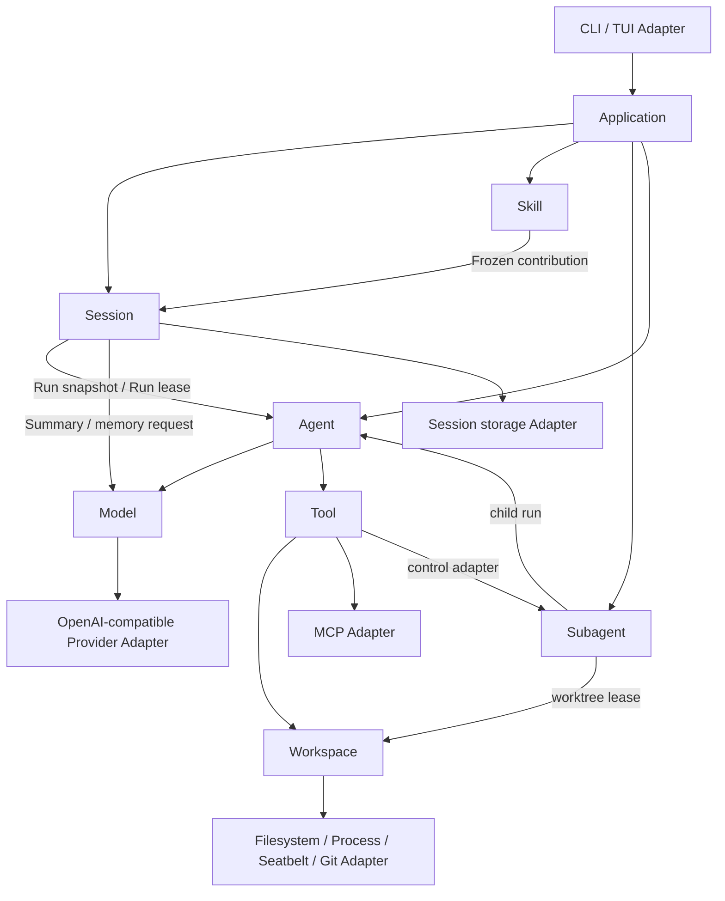

# ch14：ArtCode 语义统一与破坏性整体重写 Plan

## 计划基线

本 Plan 以根目录 `spec.md` 和 2026-09-04 本地对话中的最终决定为依据。发生冲突时按以下顺序解释：

1. ch14 明确写出的新语义无条件覆盖旧章节、旧测试和当前实现。
2. ch14 没有写到的用户行为与配置继续沿用当前现役语义，不重新发明默认值。
3. 不保留旧命令、旧配置格式、旧持久格式、旧模块和旧测试夹具的兼容层。
4. Plan Run 绝对禁止 `change`、`external` 和 `control` Tool Effect；规则与人工批准不能解除。
5. 旧 Session、记忆、权限和派生运行数据不迁移；无价值旧数据与失去调用方的旧实现直接删除。
6. Provider 不执行透明自动重试；一次 Model 请求只对应一次底层请求尝试。
7. 不为累计 User 原文最终超过模型窗口设计额外产品能力；Provider 上下文超限按普通失败处理。

其中“Plan 无 external Tool Effect”只约束 Tool 调用，不把 Plan 自身必须进行的 Model 请求误分类为 Tool Effect。MCP Tool 在 Plan 的目录和执行入口中都不可用。

## 目标结构

新核心由八个语义模块组成。模块不要求一一对应顶层目录，但每个模块只能向调用方公开一个 Interface；内部可以包含多个私有 seam 和 Adapter。

依赖规则：

- Application 可以认识所有模块的 Interface，但不能读取它们的私有状态。
- Agent 只认识 Model、Tool 和本次 Run 的不可变输入，不认识 TUI、Provider、MCP、持久格式或 Git。
- Session 只通过 Model Interface 生成 Summary 和长期记忆，不调用具体 Provider，不执行 Tool，也不直接操作 Worktree。
- Tool 不修改 Transcript，不拥有 Task，也不依据 TUI 状态推断权限。
- Workspace 不理解 Prompt、Session、Skill、Role 或 Tool 名称。
- Skill 不拥有主 Transcript，不调度 Task，不取得 Worktree。
- Subagent 复用 Agent、Model、Tool Interface，不复制第二套运行循环。
- Adapter 依赖所属模块的 Interface；核心模块不得反向导入具体 Adapter。

## 状态所有权

| 状态 | 唯一所有者 | 其他模块如何使用 |
|---|---|---|
| Application 生命周期与当前前台操作 | Application | 只读 Application snapshot |
| 配置合成结果 | Application | 启动时分发不可变配置片段 |
| Transcript、Session 锁与恢复状态 | Session | Run lease 与不可变 Transcript view |
| 最近成功计划 | Session | Act Run 开始时生成不可变计划输入 |
| Notice 及其待投递状态 | Session | 真正 dispatch 时由 Run lease 消费 |
| Summary 与压缩状态 | Session | 只通过 Prompt 投影进入 Run |
| 用户级/项目级长期记忆及索引 | Session | Prompt 投影与只读状态摘要 |
| 主 Session 已提交 usage | Session | 状态查询读取汇总快照 |
| 当前 Run 轮次、临时文本、Tool 协议和 usage | Agent | RunEvent 与最终 RunOutcome |
| Provider 连接与协议解释 | Model | 类型化 ModelEvent |
| Protocol Metadata 的语义解释 | Model | 生成和读取不透明 envelope |
| 已提交 Protocol Metadata 值及生命周期 | Session | 原样持久化并随 Prompt 交回 Model |
| Tool 目录、Effect 分类、权限模式、Shell 策略和持久规则 | Tool | ToolSnapshot 与权限状态快照 |
| MCP Server 会话和激活目录 | Tool 内部 MCP Adapter | 只通过 Tool Interface 暴露 |
| Workspace 根、路径策略、进程、Seatbelt 与结果文件 | Workspace | Workspace scope 与结构化结果 |
| Worktree 创建、检查和文件生命周期 | Workspace | Worktree lease 与 handoff |
| Skill 目录、激活集合和最后有效版本 | Skill | Frozen SkillContribution |
| Role 目录、Task 队列、子 Run 状态与通知 | Subagent | Task snapshot、通知与 handoff |
| Subagent Run usage | Subagent | 从 RunOutcome 接收后写入 Task snapshot |

所有“快照”都是值，不是共享可变对象。拥有者更新状态后必须生成新快照；调用方不能通过快照反向修改拥有者。

## 八个深模块

### 1. Application

**Interface 提供：**

- 从启动选项构建并运行一个 Application。
- 接受一条用户输入并产生有序的用户可见事件。
- 返回脱敏、只读的全局状态快照。
- 取消当前前台操作并有序关闭全部资源。

**内部隐藏：**

- 用户级与项目级配置的读取、合成和严格校验。
- Session 选择、命令分流、TUI 事件转换和模块组装顺序。
- 资源注册、关闭次序、启动中途失败回滚和信号处理。
- Subagent Tool Adapter 的迟绑定，避免组装时形成隐式全局变量。

Application 不保存 Transcript、权限、Skill 激活、Task 列表或 usage 副本。状态界面临时聚合各模块快照，不形成第二份权威状态。

### 2. Session

**Interface 提供：**

- 新建、恢复或选择新格式 Session。
- 为一次 Run 打开 Run lease，冻结 Transcript、计划、指令、Notice、Summary、记忆、Skill contribution 和 Tool catalog。
- 原子提交 User、Assistant 和完整 Tool exchange 事实。
- 完成、取消或失败一个 Run，并返回新的 Session snapshot。
- 执行压缩、长期记忆更新和只读状态查询。

**内部隐藏：**

- 新持久格式、文件锁、同步追加、坏尾部处理和恢复扫描。
- Prompt 的 section 顺序、预算估算、Summary 生成和大结果引用。
- Notice 的一次性消费点、最近计划和长期记忆索引。
- Provider 要求的 Protocol Metadata envelope 的原样存取。

Transcript 保存领域事实，不直接等同 Provider messages。Tool exchange 作为一个领域记录包含 Assistant Tool Request、对应的全部 Tool Result 及不透明 Protocol Metadata；投影到 Prompt 时再展开为 Provider 所需的连续消息。这样正常写入不会产生孤立 Tool Result，损坏恢复仍可退回最近完整记录。

User 在 Run 被接受时提交。Assistant 普通文本只在自然完成或长度结束时提交；取消、请求失败和流中断时已经显示的临时文本不提交。Tool 批次被取消时，为每个未完成请求生成结构化取消结果后再提交完整 exchange。

### 3. Agent

**Interface 提供：**

- 接收目标、Run Mode、Run lease 和不可变执行上下文，推进一次 Run。
- 连续产生类型化 RunEvent，并最终返回一个 RunOutcome。
- 响应取消信号，在可提交的协议边界停止。

**内部隐藏：**

- Model/Tool 轮转、批次序号、轮次计数、临时流文本和 usage 汇总。
- Tool Request 与 Tool Result 的协议闭合。
- Stop Reason 映射和异常停止时的资源交接。

普通 Run 没有产品级固定轮数；自动化、Isolated Skill 和 Subagent 可以显式携带限制。Agent 不自行选择 Provider，不直接写 Session，不检查路径，不执行权限判断，也不保存跨 Run 状态。

### 4. Model

**Interface 提供：**

- 接收完整、不可变的 Model request。
- 返回文本、Tool Request、usage、结束原因和不透明 Protocol Metadata 的类型化流事件。
- 返回可区分、已脱敏的失败类别。
- 关闭本模块拥有的连接。

**内部隐藏：**

- OpenAI-compatible payload、SSE、Tool delta 组装和 finish reason。
- Thinking 参数适配、Protocol Metadata 编解码、连接池与错误清理。

一次 Interface 调用只允许一次底层网络请求。连接错误、空响应、解码错误、超时和流中断均直接返回对应失败，不进行透明自动重试。当前 `MAX_STREAM_ATTEMPTS` 及相关首事件前重试代码在切换前删除。

Model 只报告 Provider 实际返回的 usage，不估算、不累计。Thinking 内容不显示、不进入普通 Assistant 文本、不进入 Summary 或长期记忆；Provider 续接 Tool 所必需的字段转成不透明 Protocol Metadata，由 Session 原样保存。

### 5. Tool

**Interface 提供：**

- 根据 Run Mode、Skill 限制、调用来源和权限快照生成不可变 ToolSnapshot。
- 对一个完整 Tool 批次进行准备、策略判断、审批、执行和结果排序。
- 查询或修改权限模式、Shell 策略和精确持久规则。
- 启动、诊断并关闭 MCP Adapter。

**内部隐藏：**

- 内置与 MCP Tool 注册、Schema 适配、名称冲突和按需激活。
- Tool Effect、硬约束、显式规则、模式策略与 HITL 的决策顺序。
- observe 并发计划、效果型顺序执行、超时和结构化失败。

固定 Plan 规则：

- ToolSnapshot 只包含内置 `observe` Tool。
- `change`、`external`、`control` Tool 不向模型暴露。
- 即使绕过目录伪造调用，执行入口仍以硬约束拒绝。
- MCP Tool、Subagent Tool、Task 控制 Tool 和 Shell 均不可用。
- 权限规则、Full 模式和人工批准都不能改变上述结果。

普通 Run 中，相邻 observe Tool 可以并发；change、external 和 control 按模型请求顺序执行。局部失败不取消无依赖且已经开始的 observe Tool，最终结果始终按原请求顺序回传。

### 6. Workspace

**Interface 提供：**

- 创建绑定明确根目录的 Workspace scope。
- 执行类型化的文件、搜索、进程和结果文件操作。
- 为 Task 创建、检查、交接或安全清理 Worktree lease。
- 取消进程树并关闭本模块拥有的临时资源。

**内部隐藏：**

- 路径规范化、敏感路径、符号链接和执行前复检。
- 原子文件替换、唯一编辑、输出预览和完整结果落盘。
- 子进程组、超时、取消和 macOS Seatbelt Profile。
- Git 命令、Worktree 命名、初始化、状态判断与成果保护。

每个 Workspace scope 显式携带根目录，不读取进程当前目录决定归属。主 Workspace 与每个 Worktree 使用独立 scope；缓存键包含 scope 身份和规范化绝对路径。

旧运行数据不迁移。切换时可以删除旧 Session、记忆、权限、索引、临时结果和无成果的旧托管目录。包含未提交修改或未安全交接提交的 Worktree 仍属于用户成果，继续按 F91–F92 保护；保护的是代码成果，不是旧元数据格式兼容性。

### 7. Skill

**Interface 提供：**

- 发现并刷新可用 Skill 目录。
- 激活、清除并查询当前 Session 的 Skill 集合。
- 为新 Run 生成冻结的 SOP、Tool 收窄和模型选择 contribution。
- 为 Isolated Skill 生成临时执行输入并接收最终总结。

**内部隐藏：**

- 单文件和目录型能力包解析、多来源覆盖、诊断及最后有效版本。
- 自然语言选择与明确命令激活、热更新和白名单交集。
- Shared/Isolated 两种执行投影及近期完整轮次选择。

没有使用 Skill 时沿用现役工具与 Prompt 行为。坏热更新继续使用当前 Session 的最后有效版本。Isolated Skill 使用临时 Transcript，只取得配置声明的近期完整轮次，结束后仅把最终总结交给主 Session；它不产生 Task、Worktree 或后台状态。

### 8. Subagent

**Interface 提供：**

- 提交定义式或 Fork 式 Subagent Task。
- 列出、查看、等待、转后台和取消 Task。
- 在安全 Prompt 边界提取一次性完成通知。
- 关闭当前进程中的调度，并返回成果交接快照。

**内部隐藏：**

- Role 发现、覆盖、模型档位与能力收窄。
- Task 排队、并发、前台超时转后台、状态机和 usage。
- 子 Run 创建、非交互限制、Worktree lease 与通知顺序。

定义式从干净 Transcript 和 Role 开始；Fork 式冻结父 Prompt 与 ToolSnapshot，并始终后台执行。Subagent 不能递归委派、询问用户或继承父 Run 的临时批准。可能写盘的 Task 在模型首次请求前取得 Worktree lease；失败时不降级到主 Workspace。

## 关键运行流程

### 普通 Run

1. Application 将输入确定分流为本地命令、Skill 命令或 Model Run。
2. Skill 刷新目录并生成当前激活集合的冻结 contribution。
3. Tool 根据 `chat` 或 `act` 生成 ToolSnapshot。
4. Session 打开 Run lease，提交 User 事实并生成不可变 Prompt 与执行上下文。
5. Application 标记请求真正 dispatch，Session 此时才消费适用 Notice。
6. Agent 调用 Model；文本增量只作为 RunEvent 展示。
7. 若 Model 请求 Tool，Agent 把完整批次交给 Tool，取得有序结果后通过 Run lease 提交完整 Tool exchange。
8. Agent 继续循环，直到自然完成、取消、失败、长度结束、显式限制或不可继续。
9. Session 按 RunOutcome 提交最终事实、usage、计划和必要状态；仅自然完成触发异步记忆更新。

### Plan 与 Act

1. Plan 使用只含内置 observe Tool 的 ToolSnapshot。
2. 任何伪造的 change、external 或 control 调用在 Tool Interface 再次硬拒绝。
3. 成功 Plan 的最终文本作为最近计划由 Session 保存。
4. Act 从 Session 取得最近成功计划，与用户新增约束共同形成新目标。
5. Act 使用普通效果策略，不继承 Plan Run 的临时状态或批准。

### Subagent Task

1. Tool 内的 Subagent Adapter 把当前不可变父 Run snapshot 交给 Subagent。
2. Subagent 冻结 Role、能力上限、代码基准和 Task 输入后入队。
3. 写任务先从 Workspace 取得 Worktree lease，再创建子 Run。
4. 子 Run 使用同一 Agent、Model 和 Tool Interface，但使用独立 Run 状态、Workspace scope 和权限事件。
5. 完成、失败或取消后，Workspace 生成 handoff；Subagent 保存 TaskOutcome 和 usage。
6. 通知进入 Subagent 收件箱，只在父 Run 的下一安全 Prompt 边界投递一次。

## 配置与持久化策略

- ch14 没有明确改变的配置项、默认值和范围沿用当前有效配置。
- 删除旧字段别名、兼容解析分支和根据历史章节猜测配置的逻辑。
- 用户级与项目级配置先分别严格校验，再按确定顺序整体合成。
- 新持久格式从新版本命名空间开始；不读取、不转换旧 Session、记忆、权限或索引格式。
- 首次切换可以直接清理旧运行数据，不提供迁移命令、回滚读取器或双写。
- Transcript 采用可逐条原子追加、人工可检查的新格式；具体字段、版本号、路径和大小限制在 Checklist 固定。
- 大 Tool Result 位于当前 Workspace scope 的内部临时区；Transcript 只保存稳定引用和有界预览。
- Worktree 成果保护独立于 Session 格式。无法证明无成果的目录不自动删除。

## 开发隔离与一次性切换

- 新核心直接使用最终计划保留的模块与 Interface，不在旧模块外再包一层转发。
- 开发期间旧 Application 继续服务当前生产入口；新 Application 只由新黑盒测试和明确的开发入口创建。
- 新核心不得导入旧 Runtime、Conversation、Prompt、Permission、Background 或其他旧业务实现；允许复用的第三方库和纯 Adapter 逻辑必须先迁入所属新模块。
- 不建立新旧双写、状态同步、运行时 Feature Flag 或旧格式读取回退。
- 每个新模块先在自己的 Interface 后通过测试，再接入新 Application；旧核心此时仍不依赖新模块。
- 新 Application 达到切换门槛后，同时替换 console script 与 `python -m artcode` 的组装入口，然后在同一切换阶段删除旧核心。
- 切换提交完成后仓库只保留一条生产路径；开发入口、临时组装代码和过渡测试一并删除。

## 实施阶段

### 阶段 1：冻结新 Interface 与行为矩阵

- 把本地对话中的覆盖规则、Plan 绝对无外部效果、旧数据不保留、无自动重试和窗口极限 Out of Scope 写回 Spec。
- 为八个模块建立 Interface 契约测试骨架和状态所有权检查。
- 从旧测试提取仍适用的用户场景；删除或改写与 ch14 新语义冲突的断言。
- 建立 Application 黑盒行为矩阵，禁止用 F97 代替具体场景。

### 阶段 2：Workspace 与 Model

- 先实现 Workspace scope、本地效果、Seatbelt、进程树和 Worktree lease。
- 实现单请求、无自动重试的 Model Interface 与 DeepSeek/OpenAI-compatible Adapter。
- 用本地替身、真实进程、真实 Git、真实 Seatbelt 和真实 Provider 分别验证两个模块。

### 阶段 3：Tool

- 统一内置 Tool 与 MCP Adapter 的描述、Effect、策略和结构化结果。
- 把权限模式、Shell 策略、规则和 HITL 收敛到 Tool 唯一所有者。
- 实现 Plan 双重防线、observe 并发和效果型顺序执行。
- 通过 Tool Interface 测试 Workspace、MCP、审批和批次，而不穿透内部执行器。

### 阶段 4：Session

- 建立新 Transcript 记录、Run lease、Prompt 投影和恢复。
- 收敛 Notice、Summary、计划、记忆、usage 和 Protocol Metadata 生命周期。
- 实现大结果引用、压缩、锁和新格式故障恢复。
- 只验证新格式；旧持久数据测试改为确认不加载并被允许清理。

### 阶段 5：Agent

- 用 Model、Tool、Session 三个 Interface 实现唯一 Run 状态机。
- 覆盖自然完成、长度结束、显式限制、取消、Model 失败、Tool 局部失败和不可继续。
- 普通 Run 验证无固定轮次；取消验证临时文本不提交且 Tool exchange 完整闭合。

### 阶段 6：Skill 与 Subagent

- Skill 只产出冻结 contribution 或 Isolated 执行输入，不侵入 Session/Tool 私有状态。
- Subagent 复用唯一 Agent 实现，收敛 Role、Task、通知和 Worktree 交接。
- 分别验证 Shared/Isolated Skill 与定义式/Fork 式 Subagent，不把二者合并成通用后台执行框架。

### 阶段 7：Application 接入

- 建立唯一生产组装路径和 CLI/TUI Adapter。
- 所有本地命令通过各模块 Interface 查询或改变状态。
- 源码入口与安装入口使用同一 Application 构造路径。
- 旧生产入口保持到新 Application 黑盒矩阵通过，但不得让新核心调用旧核心。

### 阶段 8：一次性切换与删除

- 将两个生产入口同时切换到新 Application。
- 删除旧核心、旧持久读取器、旧配置兼容、浅转发模块、章节式产品文本和失去调用方的测试。
- 删除 Provider 自动重试改动及其测试，保留“单次失败直接报告”的契约测试。
- 用导入审计确认生产代码不再依赖旧路径；不保留仅为旧测试服务的 seam。
- 清理旧运行数据；Worktree 仅按成果安全规则处理。

### 阶段 9：最终验收与冻结

- 运行全部新 Interface 测试、Application 黑盒、属性、故障、压力和真实集成测试。
- 完成源码安装、wheel 安装、真实 TUI、真实 DeepSeek、真实 MCP、真实 Seatbelt、真实进程与双 Worktree 场景。
- 核对 Spec、Plan、Tasks、Checklist、CONTEXT、用户文档和最终实现。
- 记录验收结果，冻结领域语言和外部契约。

## 测试策略

遵循“替换而不是叠加”：一个新模块的 Interface 测试足以保护相同行为后，删除穿透旧私有 seam 的测试。旧测试只作为场景来源，不作为必须保持的文件或 Mock 形状。

| 层级 | 主要证明内容 |
|---|---|
| Interface 单元测试 | 状态转换、不可变快照、错误分类和调用方契约 |
| 确定性集成测试 | Session–Agent–Model–Tool–Workspace 的完整协作 |
| Application 黑盒 | 输入、终端事件、Transcript、文件效果、Task 和退出结果 |
| 属性测试 | 路径、规则、协议组、消息顺序和非法配置空间 |
| 故障注入 | 磁盘、流、MCP、进程、通知、取消和关闭竞态 |
| 压力测试 | 长 Run、重复压缩、并发 Task 和资源回收 |
| 真实集成 | DeepSeek、MCP、Seatbelt、Git Worktree、构建与安装 |

必须新增或调整的关键场景：

- Plan 请求中只存在内置 observe Tool；伪造 MCP、Shell、写入和 Subagent 调用均不产生效果。
- Model 在首事件前发生传输错误时只发送一次底层请求，并直接返回脱敏失败。
- 新版本不恢复旧 Session、记忆和权限；旧兼容读取器不存在。
- Transcript 的 Tool exchange 始终完整，取消和故障不会产生孤立结果。
- Protocol Metadata 可以完成 Tool 续接，但无法作为文本显示、Summary 或记忆输入。
- 同时运行两个写 Task 时，主 Workspace 与两个 Worktree 互不覆盖。
- 未使用 Skill、MCP 或 Subagent 时，普通对话路径不承担额外操作步骤。
- Application 关闭后不存在仍由当前进程负责的连接、子进程、Task 或临时锁。

## 删除清单

切换完成后必须删除：

- 所有旧命令、配置、持久格式和内部 Interface 的兼容解析与转发。
- Transcript、Prompt、权限、usage、Skill 激活和 Task 的重复状态副本。
- 由 TUI、Agent 或 Subagent 私自维护的 Tool 名称与 Effect 清单。
- 根据进程当前目录推断 Workspace 的生产路径。
- 旧 Provider 自动重试常量、循环和对应成功重试测试。
- 新 Interface 已覆盖后仍穿透旧私有实现的测试。
- ch11/chTA 评测系统的残余生产导入、章节编号产品文本和无调用方模块。

不得删除：

- 当前 Workspace 中不属于 ArtCode 运行数据的用户文件。
- 无法证明无成果的 Worktree、未提交修改或未安全交接提交。
- 新黑盒矩阵仍需要证明的用户能力，仅因旧实现复杂不能成为删除理由。

## 切换门槛

只有同时满足以下条件才能把生产入口切到新核心：

- 八个模块的状态所有权表与实际实现一致，不存在第二份可变权威。
- Application 黑盒矩阵覆盖全部 ch14 功能需求和明确沿用的现役行为。
- Plan 的目录、执行与审批三条路径均不能触发 external Tool Effect。
- 新持久格式可以正常创建、追加、恢复和隔离损坏；旧格式确认不再加载。
- Model 自动重试次数为零，并有捕获底层请求次数的测试证据。
- 非 live、真实 Provider、真实 MCP、真实进程、真实 Seatbelt、构建和安装验证均有结果记录。
- 两个生产入口行为等价，所有资源终止路径完成回收。
- 旧核心、兼容层和只服务旧实现的测试已经删除，生产导入审计无残留。
