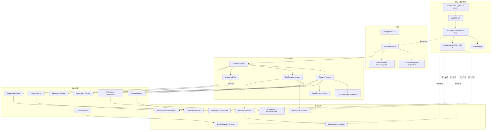

# ch10.5：总结重构 Plan

## 架构概览

ch10.5 最终采用“单一组装入口 + 薄 Runtime + Agent 状态机 + 请求准备服务 + 工具执行服务 + 独立持久化服务”的结构。T14 已将全部生产入口接到该结构，并删除迁移期兼容路径。

实际依赖方向如下：



`artcode.runtime` 只处理终端输入、命令分流、Agent 事件展示和运行状态，不再构造默认 Registry、Context、Executor 或 AgentLoop。所有生产依赖在 Bootstrap 中一次性创建，并通过 `AsyncExitStack` 按注册顺序的逆序关闭。

AgentLoop 不再直接实现请求估算、压缩决策、提醒消费、工具授权和后台记忆；它只维护“一轮模型请求 → 可选工具执行 → 下一轮模型请求 → 自然结束”的状态机。请求准备和工具执行分别由独立服务完成。

## 核心数据结构

### `AppOptions`

CLI 解析后的不可变启动参数：

```python
@dataclass(frozen=True)
class AppOptions:
    config_path: Path | None
    workspace_path: Path | None
    artcode_home: Path | None
    session_selection: SessionSelection
```

`argparse` 只负责把命令行转换为该对象。所有路径解析、配置读取和资源创建由 Bootstrap 完成。

### `ArtCodeConfig`

保留现有主配置对象，但移除运行期状态字段：

```python
@dataclass(frozen=True)
class ArtCodeConfig:
    protocol: str
    model: str
    base_url: str
    api_key: str
    thinking: ThinkingConfig
    context: ContextConfig
    mcp_servers_raw: Mapping[str, Any]
```

固定配置规则：

- 顶层只允许 `protocol`、`model`、`base_url`、`api_key`、`thinking`、`context`、`mcp_servers`。
- `thinking` 只允许 `enabled`；删除可选择的 effort 字段。
- `context` 只允许 `window_tokens`。
- 默认上下文窗口为 `1_000_000` Token；显式窗口继续接受 `200_000` 至 `1_000_000`。
- 配置示例使用模型 ID `deepseek-v4-flash`，对应经核验的 `DeepSeek-V4-Flash-0731`。
- `mcp_servers` 缺省时使用空映射，存在时必须是映射。
- `workspace`、`SafeConfigStatus` 和章节名称不再属于配置对象。

未知字段由统一的 `_reject_unknown_keys(raw, allowed, path)` 校验。错误信息使用配置路径表示层级，并一次列出当前对象的全部未知键。

### `RuntimeState`

进程内唯一可变运行状态：

```python
@dataclass
class RuntimeState:
    permission: PermissionState
    display_mode: DisplayMode = DisplayMode.DEFAULT
    last_token_usage: TokenUsage | None = None
```

`PermissionState` 继续唯一保存权限模式和 Shell 策略。Tool 环境、Runtime 和状态展示不得复制 Shell 策略。`RuntimeState.startup_snapshot(...)` 与 `status_snapshot(...)` 根据显式运行信息生成不可变快照。

每次 Agent 运行开始或每次工具批次执行前，从唯一 PermissionState 生成不可变快照：

```python
@dataclass(frozen=True)
class PermissionSnapshot:
    mode: PermissionMode
    shell_policy: ShellPolicy
```

审批导致的永久规则写入磁盘规则层，不回写该快照；下一次工具批次重新取得最新快照。

### `ToolEnvironment`

工具运行期间不变的资源：

```python
@dataclass(frozen=True)
class ToolEnvironment:
    path_policy: WorkspacePathPolicy
    command_timeout_seconds: float
    default_cwd: Path | None
    seatbelt: SeatbeltSession | None
    artifact_store: ContextArtifactStore | None
```

该对象不再保存 `PermissionState` 或 Shell 策略。每次执行由 `ToolRunContext` 显式携带当前模式与权限快照：

```python
@dataclass(frozen=True)
class ToolRunContext:
    environment: ToolEnvironment
    mode: AgentMode
    permission: PermissionSnapshot
```

### `ToolDescriptor`

所有工具只有一份能力描述：

```python
class ToolEffect(StrEnum):
    READ = "read"
    WRITE = "write"
    SHELL = "shell"
    EXTERNAL = "external"

@dataclass(frozen=True)
class ToolDescriptor:
    name: str
    description: str
    parameters_schema: Mapping[str, Any]
    effect: ToolEffect
    origin: ToolOrigin
    rule_configurable: bool
```

`Tool` Protocol 暴露一个 `descriptor`，不再分别依赖 `requires_confirmation`、`approval_policy` 和多个硬编码名称集合。

固定策略：

- Normal 与 Do 可看到全部已注册工具。
- Plan 只允许内置 READ 工具；MCP 工具保持前序章节语义，可见但始终单次人工确认，并明确显示 Plan 状态。
- READ 工具可以同批并发。
- WRITE、SHELL 工具串行执行。
- EXTERNAL 工具按同一批次并发调用，但每个调用分别确认。
- 权限 YAML 只接受 `rule_configurable=True` 的内置工具名称，MCP 始终不能通过永久规则绕过单次确认。

### `ProviderRequest`

Provider 只接收一个完整请求对象：

```python
@dataclass(frozen=True)
class ProviderRequest:
    messages: tuple[Message, ...]
    tools: tuple[ToolSchema, ...] | None
    max_output_tokens: int | None = None
    thinking_enabled: bool | None = None
```

`thinking_enabled=None` 使用主配置；摘要和记忆显式传 `False`。普通 Agent 请求不再通过散落的可选参数组装 Provider 调用。

### Provider 流事件

`StreamingProvider.stream(request)` 返回以下不可变事件联合：

```python
ProviderEvent = (
    ContentDelta
    | ReasoningDelta
    | ToolCallsCompleted
    | UsageReported
    | StreamCompleted
)
```

- `ContentDelta(text)`：用户可见文本。
- `ReasoningDelta(text)`：Thinking 推理内容，只为当前模型轮次累积，不直接显示。
- `ToolCallsCompleted(calls)`：组装完成的工具调用。
- `UsageReported(usage)`：真实 Token 用量。
- `StreamCompleted(finish_reason)`：服务端结束原因；Agent 不对长度结束创建特殊业务状态。

`TokenUsage` 移到 Provider 公共模型中，避免 Provider 依赖 Agent 事件模块。

### `ModelTurn`

Stream Collector 的最终结果：

```python
@dataclass(frozen=True)
class ModelTurn:
    text: str
    reasoning_content: str
    tool_calls: tuple[ToolCall, ...]
    usage: TokenUsage | None
    finish_reason: str | None
```

带工具调用时，Conversation 保存 Assistant 工具调用消息中的非空 `reasoning_content`。自然文本结束时推理内容不写入用户可见历史。

### `PromptRequest`

纯请求组装结果：

```python
@dataclass(frozen=True)
class PromptRequest:
    messages: tuple[Message, ...]
    tools: tuple[ToolSchema, ...] | None
    includes_resume_reminder: bool = False
```

`PromptRequestAssembler.assemble(...)` 通过显式参数决定是否包含恢复提醒。它不保存 `_resume_reminder_pending`，因此任意次数调用都不会改变应用状态。

### `PreparedModelRequest`

请求准备结果：

```python
@dataclass(frozen=True)
class PreparedModelRequest:
    request: PromptRequest | None
    events: tuple[AgentEvent, ...] = ()
    error_message: str = ""
    consumes_resume_reminder: bool = False
```

`RequestPreparer` 保存一次性提醒是否待发送。估算和预览只读取该状态；AgentLoop 在真正开始 Provider 调用前执行 `mark_dispatched(prepared)`，只有携带提醒的请求会清除待发送状态。

### `AgentRunRequest`

```python
@dataclass(frozen=True)
class AgentRunRequest:
    user_content: str
    mode: AgentMode
    max_iterations: int | None = None
    append_user_message: bool = True
    final_summary_on_abnormal_stop: bool = True
```

`None` 表示正常交互无限循环。显式整数只供测试、自动化和特定内部调用使用。循环实现使用计数器与 `while`，TUI 在无限模式下只显示当前轮数。

### `CompletedTurn`

现有 `NaturalTurn` 重命名并固定为深拷贝后的不可变轮次：

```python
@dataclass(frozen=True)
class CompletedTurn:
    session_id: str
    mode: str
    user_content: str
    final_text: str
    entry_ids: tuple[str, ...]
    tool_summaries: tuple[ToolSummary, ...]
```

只有无工具的自然最终回复产生该对象。MemoryService 接收后不得访问或修改 Conversation。

### `SessionContext`

会话启动结果：

```python
@dataclass(frozen=True)
class SessionContext:
    conversation: ConversationContext
    plan_memory: PlanMemory
    status: PersistenceStatus
    resume_reminder_required: bool
```

SessionService 负责创建或恢复该对象；Prompt、Memory 和 Runtime 不再通过一个大 Coordinator 互相访问。

## 模块设计

### 1. CLI 与 Bootstrap

**文件：** `artcode/__main__.py`、`artcode/cli.py`、`artcode/bootstrap.py`

**职责：**

- `cli.py` 只定义 argparse 参数、建立 `AppOptions` 并调用异步入口。
- `bootstrap.py` 是唯一 Composition Root。
- 使用 `AsyncExitStack` 注册同步与异步清理函数。
- 依次创建应用路径、Workspace、唯一 DurablePaths、配置、Provider、Session、Artifact Store、权限规则、Seatbelt、TUI、MCP、Memory、Context、Prompt、Tool、Agent 和 Runtime。
- 启动错误保留真实错误类型；Config、Workspace、Session、Seatbelt 和 MCP 启动错误不再全部伪装为 ConfigError。

**关闭顺序：**

1. 停止 Memory Worker，丢弃未完成后台请求。
2. 停止接受 MCP 调用并关闭 Server 会话。
3. 关闭 Seatbelt 临时资源。
4. 清理当前 Context Artifact 目录。
5. 关闭 Session Journal 并释放文件锁。
6. 关闭 DeepSeek HTTP Client。

逆序由 `AsyncExitStack` 保证；任何创建步骤失败时只关闭已经成功注册的资源。

### 2. 配置

**文件：** `artcode/config.py`、`config.example.yml`

**职责：**

- 严格解析主配置与嵌套段。
- 只保存模型请求需要的配置。
- 删除 `CHAPTER_NAME`、`SUPPORTED_THINKING_EFFORTS`、`SafeConfigStatus`、`ArtCodeConfig.workspace`。
- Thinking 启用只保留布尔开关。
- 默认窗口改为 1M，阈值比例保持前序章节不变。
- 错误文本使用 `~/.artcode/config.yml`。

### 3. Runtime 与终端状态

**文件：** `artcode/runtime/app.py`、新增 `artcode/runtime/state.py`、`artcode/commands/base.py`、`artcode/tui/app.py`、`artcode/tui/render.py`

**职责：**

- Runtime 构造参数全部为必需依赖，不提供生产默认组装分支。
- Runtime 负责输入循环、CommandDispatcher、Agent 任务取消和事件转发。
- `RuntimeState` 保存进程内可变状态并生成 Startup/Runtime 两种脱敏快照。
- `/status` 调用 RequestPreparer 的纯预览估算，不调用会消费提醒的方法。
- TUI Protocol 中已声明的方法改为直接调用，删除为旧 Fake TUI 保留的 `getattr` 兜底；测试 Fake 必须完整实现协议。
- Runtime 不再通过 `object.__setattr__` 修改 Tool 环境。
- Session 与 Memory 的显示数据由各服务返回不可变摘要，Runtime 只交给 TUI 渲染。

### 4. DeepSeek Provider

**文件：** `artcode/providers/deepseek.py`、`base.py`、`events.py`、`__init__.py`、`agent/stream.py`

**职责：**

- `DeepSeekChatProvider` 明确表达当前唯一 Provider。
- 构造时创建一个 `httpx.AsyncClient`，测试可注入 MockTransport；`close()` 由生命周期统一调用。
- Thinking 关闭始终发送 `{"thinking":{"type":"disabled"}}`。
- Thinking 开启发送 `{"thinking":{"type":"enabled"}}` 和 `"reasoning_effort":"high"`。
- SSE 解析 `reasoning_content`、文本、工具调用增量、usage 与 finish reason。
- 收到 `[DONE]` 前连接结束仍视为流中断。
- Stream Collector 不再接受“Provider 无 DONE 也算成功”；Fake Provider 必须显式产生完成事件。
- Assistant 工具调用后续请求完整回传推理内容。
- HTTP 错误正文继续经过秘密清理。

### 5. Conversation、Prompt 与 RequestPreparer

**文件：** `artcode/conversation/context.py`、`artcode/prompting/assembler.py`、`artcode/prompting/reminder.py`、新增 `artcode/agent/request.py`、修改 `artcode/agent/loop.py`

**职责：**

- Conversation 支持 Assistant 工具调用消息携带可选推理内容。
- Conversation 中的真实 User Entry 永不被删除或改写，因此不再需要依赖一份可与 Entries 偏离的用户消息副本作为压缩恢复来源。
- Prompt Assembler 只根据显式输入构造请求；运行提醒和恢复提醒都是 request-only 消息，不进入 Conversation、用户记录或 Session Journal。
- `RequestPreparer` 统一执行轻量压缩、请求组装、估算、持久化失败边界、自动压缩和紧急超限重试。
- ContextWindowExceeded 只允许一次紧急压缩和一次原请求重试。
- 恢复提醒在首次实际 Provider 尝试开始时消费；压缩导致的重复组装继续携带同一提醒。
- AgentLoop 只追加已确定消息、循环调用 Provider、调用 ToolExecutionService、处理取消并发布 CompletedTurn。

### 6. 上下文压缩

**文件：** `artcode/context_management/manager.py`、`retention.py`、`summarizer.py`、`models.py`、`lightweight.py`

**核心变化：**

RetentionPlan 明确区分：

```python
@dataclass(frozen=True)
class RetentionPlan:
    compactable_entries: tuple[ConversationEntry, ...]
    preserved_user_entries: tuple[ConversationEntry, ...]
    recent_entries: tuple[ConversationEntry, ...]
```

压缩提交后的顺序固定为：

1. 原始固定 System Prompt。
2. 新生成的只读 Assistant/Tool/System 历史摘要。
3. 一条 System 标记，说明接下来的 User 消息是历史原文记录。
4. 被压缩区间内全部原始 User Entry，保持独立 `role=user`、原内容和原顺序。
5. 一条上下文边界 System 消息。
6. 未压缩的近期完整历史。

摘要模型仍可读取待压缩区间以理解语义，但正式摘要第六段只写“用户原文在摘要后以独立消息保留”，不再把用户原文嵌入一个 System 摘要字符串。再次压缩时，上一版摘要属于可压缩内部 System，历史 User Entry 仍被单独保留。

删除单条超大用户消息的专用预检阻断。若用户原文导致摘要请求或普通请求超过服务能力，按普通 Provider 错误处理，不引入新状态机。

### 7. 工具执行、权限、文件与进程

**文件：**

- `artcode/tools/base.py`
- `artcode/tools/registry.py`
- 将 `artcode/agent/tools.py` 迁移为 `artcode/tools/execution.py`
- 新增 `artcode/tools/filesystem.py`
- 新增 `artcode/tools/process.py`
- 修改 `artcode/tools/file_tools.py`、`command_tool.py`
- 新增 `artcode/permissions/service.py`
- 修改 `artcode/permissions/engine.py`、`rules.py`、`models.py`

**ToolExecutionService：**

- 解析工具参数。
- 根据 ToolDescriptor 构造批次。
- 为每次执行建立显式 ToolRunContext。
- 调用 PermissionService。
- 捕获单个工具的普通异常并转换为 `tool_execution_error`。
- 并发批次使用逐项异常归一化，`CancelledError` 继续向上传递。
- ToolExecutionService 不保存 `plan_mode` 或 Shell 策略等跨调用可变字段。

**PermissionService：**

- 包装 PermissionEngine、RuleWriter 和 ApprovalPort。
- 根据 ToolDescriptor.effect 判断默认权限。
- 负责一次性选择和永久规则写入。
- MCP 调用始终走单次确认，不进入 RuleWriter。

**WorkspaceFileAccess：**

- 准备阶段保存用户原始相对路径、基准目录、批准时实际目标和展示目标。
- 新文件路径从最近存在祖先开始验证，允许剩余父目录尚不存在。
- 执行前重新解析路径和符号链接；实际目标与批准目标不一致时拒绝。
- 创建目录后再次验证创建结果仍在 Workspace 且不属于敏感路径。
- Write/Edit 使用同目录临时文件、flush、fsync 和 `os.replace`，失败时旧文件保持完整。
- Workspace 内符号链接解析到实际内部目标；外部或敏感目标拒绝。

**ProcessSupervisor：**

```python
async def run(
    argv: Sequence[str],
    cwd: Path,
    env: Mapping[str, str],
    timeout_seconds: float,
) -> ProcessResult:
    ...
```

- 始终 `start_new_session=True`。
- Timeout 时向进程组发送 `SIGKILL`，等待进程回收，返回超时结果。
- CancelledError 时向进程组发送 `SIGKILL`，等待进程回收，再重新抛出 CancelledError。
- 进程启动失败返回结构化错误。
- Seatbelt 前缀由集中 Sandbox 边界生成，当前 Profile 固定拒绝网络。

### 8. Session、Prompt Source 与 Memory

**文件：**

- 新增 `artcode/persistence/session_service.py`
- 新增 `artcode/persistence/memory_service.py`
- 新增 `artcode/prompting/durable.py`
- 保留并修改 `sessions.py`、`notes.py`、`updater.py`、`instructions.py`、`models.py`
- 删除迁移完成后的 `persistence/coordinator.py`

**SessionService：**

- 接收 Bootstrap 创建的唯一 DurablePaths，并创建 SessionCatalog 和 Journal。
- 根据 SessionSelection 创建或恢复 SessionContext。
- 将 Journal 作为 ConversationObserver 注入。
- 提供会话摘要、状态和关闭能力。
- 恢复规则继续由 SessionRecovery 单独实现，不在服务层重复解析 JSONL。

**DurablePromptSource：**

- 只负责稳定构建固定 Prompt、三层指令和两级记忆索引。
- 读取最新原子索引，但不拥有 Memory Worker。
- 不负责会话选择、恢复压缩或 UI 状态。

**MemoryService：**

- 拥有 MemoryNoteStore、MemoryUpdater 和单消费者 Worker。
- `submit(CompletedTurn)` 立即复制并入队，不返回会影响 Agent 的业务结果。
- 队列按提交顺序串行更新。
- `close()` 取消当前任务并丢弃剩余队列，不等待远程记忆请求拖延退出。
- 回调只发布不可变 MemoryUpdateReport；回调异常被隔离。

Session、Prompt Source 和 Memory 由 Bootstrap 分别组装，共享同一个不可变 DurablePaths，互相只通过明确数据依赖。

### 9. MCP、命令和 TUI

**文件：** 保留 `artcode/mcp/*`、`artcode/commands/*`、`artcode/tui/*` 的现有边界，仅做针对性收敛。

**MCP：**

- Manager 关闭时取消并最终 await 全部活动调用，避免悬空 Task。
- 全局工具注册冲突形成可观察 Startup Report，不再静默跳过。
- `request_mcp_approval(preview, plan_mode)` 显式接收 Plan 状态。
- Adapter 把所有外部异常转换为脱敏 ToolResult。

**Commands：**

- 保留注册、解析、分发结构和现有命令集合。
- RuntimeStatusSnapshot 移到 runtime state 模块，commands/base 只保留控制协议引用。
- `/status` 使用纯 preview。

**TUI：**

- 无限循环显示“Agent Loop：第 N 轮”，有限测试上限才显示“N/M”。
- Thinking 推理内容不显示。
- 启动、Context、Session、Memory、MCP 状态继续简洁展示。
- Fake TUI 与真实 TUI 使用同一 Protocol，不使用 Runtime 的动态兜底。

## 关键模块交互

### 普通请求

```text
TUI.read_input
  → Runtime 判断普通消息
  → AgentLoop.append_user（同步 Journal）
  → RequestPreparer.prepare
      → LightweightCompactor
      → PromptRequestAssembler（纯组装）
      → TokenEstimator
      → 可选 ContextSummarizer
  → AgentLoop 标记请求已发送
  → DeepSeekChatProvider.stream
      → Content/Reasoning/Tool/Usage/Done typed events
  ├─ 无工具：append_assistant → CompletedTurn → MemoryService.submit → 结束
  └─ 有工具：append_assistant_tool_call（含 reasoning_content）
       → ToolExecutionService
       → append_tool_result（同步 Journal）
       → 下一次 RequestPreparer.prepare
```

### `/status`

```text
CommandDispatcher
  → Runtime.refresh_status
  → RequestPreparer.preview
      → PromptAssembler(include_resume_reminder = 当前 pending)
      → TokenEstimator
      × 不 mark_dispatched
      × 不压缩
      × 不写 Conversation
  → RuntimeState.snapshot
  → TUI.render
```

### Ctrl+C 取消命令

```text
SIGINT
  → Runtime.cancel Agent Task
  → CancelledError 进入 ToolExecutionService
  → ProcessSupervisor 捕获取消
  → killpg(SIGKILL)
  → await process.wait
  → 重新抛出 CancelledError
  → AgentLoop 修复缺失 ToolResult
  → Runtime 恢复 DEFAULT 显示状态
```

### 启动与关闭

```text
Bootstrap + AsyncExitStack
  → Provider
  → SessionService
  → ArtifactStore
  → Seatbelt
  → MCP
  → MemoryService
  → Context / Tools / Agent / Runtime
  → Runtime.run
  → 任意退出或异常
  → AsyncExitStack 逆序关闭所有已启动资源
```

## 文件组织

```text
artcode/
├── __main__.py                    # python -m artcode 入口
├── cli.py                         # argparse 与进程退出码
├── bootstrap.py                   # 唯一 Composition Root 与生命周期
├── config.py                      # 严格纯配置
├── runtime/
│   ├── app.py                     # 输入循环与事件协调
│   └── state.py                   # RuntimeState 与脱敏状态快照
├── agent/
│   ├── loop.py                    # Agent 状态机
│   ├── request.py                 # RequestPreparer
│   ├── stream.py                  # typed Provider event → ModelTurn
│   ├── events.py                  # Agent/TUI 事件与 CompletedTurn
│   ├── modes.py                   # Normal / Plan / Do
│   └── memory.py                  # 仅 PlanMemory
├── providers/
│   ├── base.py                    # ProviderRequest 与 StreamingProvider
│   ├── deepseek.py                # DeepSeek HTTP/SSE 适配
│   ├── events.py                  # typed Provider events 与 TokenUsage
│   ├── sse.py                     # SSE framing
│   └── tool_calls.py              # 工具增量组装
├── prompting/
│   ├── assembler.py               # 无状态请求组装
│   ├── durable.py                 # 固定规则、指令、记忆索引
│   ├── reminder.py                # request-only 运行提醒
│   ├── builder.py
│   └── sections.py
├── conversation/
│   └── context.py                 # 消息、快照、协议修复
├── context_management/
│   ├── manager.py                 # 压缩协调
│   ├── retention.py               # 非 User 压缩边界
│   ├── summarizer.py              # 九段摘要与原子提交
│   ├── lightweight.py
│   ├── artifacts.py
│   ├── estimator.py
│   └── models.py
├── tools/
│   ├── base.py                    # ToolDescriptor / Tool Protocol
│   ├── registry.py                # 单一元数据注册中心
│   ├── execution.py               # ToolExecutionService
│   ├── filesystem.py              # WorkspaceFileAccess
│   ├── process.py                 # ProcessSupervisor
│   ├── file_tools.py
│   ├── command_tool.py
│   ├── policy.py                  # 仅 WorkspacePathPolicy
│   └── results.py
├── permissions/
│   ├── service.py                 # 决策、审批和规则写入协调
│   ├── engine.py
│   ├── rules.py
│   ├── writer.py
│   └── models.py
├── persistence/
│   ├── session_service.py         # Session 生命周期
│   ├── memory_service.py          # 异步记忆生命周期
│   ├── sessions.py
│   ├── updater.py
│   ├── notes.py
│   ├── instructions.py
│   ├── paths.py
│   └── models.py
├── mcp/                           # 保留既有结构
├── commands/                      # 保留既有结构
├── tui/                           # 保留既有结构
├── sandbox/
└── security/
```

T14 已删除或替代：

- `artcode/providers/openai_compatible.py`
- `artcode/agent/tools.py`
- `artcode/persistence/coordinator.py`
- `AllowedPathPolicy`
- `SafeConfigStatus`
- `AgentRunResult`
- `PreparedToolExecution`
- 重复的 READ/WRITE/SIDE_EFFECT 工具名集合
- 未使用的 Tool approval 字段
- 生产文本中的 ch03、ch05、ch06、ch09、ch10 章节编号
- 仅用于兼容旧 Fake 的 Runtime `getattr` 分支

## BFS 迁移顺序

### Wave 0：全域行为保护

- 为 Config、Provider、Prompt、Loop、Tool、Path、Process、Context、Session、Memory、MCP、Runtime 建立失败先行测试。
- 新测试全部在当前实现上运行，明确标记“现有行为应保留”或“已确认缺陷，预期暂时失败”。
- 建立共享 Fake Provider、SSE 生成器、进程树 Fixture、损坏 JSONL 生成器和故障文件系统 Fixture。

### Wave 1：配置与 Provider 合同

- 严格配置、1M 默认窗口、Thinking 单档高强度。
- typed Provider events、推理内容与连接复用。
- Conversation 与 Session 支持推理内容续接。
- 完成真实 Thinking + tools 集成验证。

### Wave 2：请求准备与无限循环

- Prompt Assembler 纯函数化。
- 引入 RequestPreparer 和恢复提醒提交语义。
- Agent Loop 改为默认无限，保留显式上限。
- `/status` 改为纯 preview。

### Wave 3：工具、权限、路径与进程

- 统一 ToolDescriptor。
- ToolExecutionService 与 PermissionService 接管执行链。
- ToolEnvironment 去除重复状态。
- WorkspaceFileAccess 支持多级目录与执行前复核。
- ProcessSupervisor 完成 timeout/cancel SIGKILL。

### Wave 4：上下文、Session 与 Memory

- 压缩只替换非 User 历史，User Entry 独立保留。
- 删除超大用户消息专用预检。
- 拆出 SessionService、DurablePromptSource、MemoryService。
- 保持 JSONL、Markdown Note 和索引格式兼容。

### Wave 5：Bootstrap、Runtime 与资源生命周期

- 引入唯一 Bootstrap 和 AsyncExitStack。
- Runtime 移除默认组装、重复状态、持久化业务和动态 TUI 兜底。
- MCP、TUI、Commands 接入显式上下文和新状态快照。

### Wave 6：兼容层删除与全域验收

- 删除旧文件、旧类型、重复集合和章节文本。
- 更新 README、测试说明和最终架构图。
- 执行全部自动化、真实集成、压力测试和二十项用户手工验收。

每个 Wave 都必须依次通过：目标单元测试 → 相关集成测试 → 全量非 live 回归 → 受影响的真实集成测试。任何一步失败都停留在当前 Wave 修复，不带着已知失败进入下一波。

## 测试架构

### 测试目录

```text
tests/
├── unit/               # 单模块、纯函数、状态转换
├── integration/        # 多组件确定性链路
├── property/           # Hypothesis 随机与属性测试
├── fault/              # 超时、取消、损坏、写失败、断流
├── live/               # DeepSeek、MCP、Seatbelt、真实进程
├── soak/               # 长循环、重复恢复和资源泄漏
├── fixtures/           # 共享 Provider/MCP/Process/Filesystem fixtures
└── manual/             # 二十项手工验收说明与记录模板
```

现有测试在迁移时按职责移动，不为了目录调整重写断言。`pytest` 配置增加 `live`、`slow`、`property` 标记。测试依赖新增 `hypothesis` 与 `pytest-cov`，不进入生产依赖。

### 自动测试最低规模

| 类型 | ch10.5 新增独立场景下限 | 重点 |
|---|---:|---|
| 单元测试 | 550 | 纯逻辑、状态转换、事件、解析、错误分支 |
| 确定性集成测试 | 180 | Runtime—Agent—Provider—Tool—Persistence 链路 |
| Property / 故障注入 | 100 | 任意分片、损坏、路径变化、异常关闭 |
| 真实集成测试 | 20 | DeepSeek、Seatbelt、MCP、真实进程 |
| Soak / 压力测试 | 30 | 长循环、多恢复、队列和资源回收 |
| 新增合计 | 880 | 不含现有 413 项基线 |
| 最终收集目标 | 至少 1293 | 具体以 `pytest --collect-only` 为证据 |

数量是最低门槛而不是完成条件。参数化场景必须拥有独立 case ID；相同断言仅替换无意义输入不能计为高价值场景。

### 覆盖门槛

- 全项目行覆盖率不低于 95%，分支覆盖率不低于 90%。
- Config、Provider payload/SSE、Conversation、Retention、Session Recovery、Permission、WorkspaceFileAccess 和 ProcessSupervisor 的分支覆盖率不低于 95%。
- 所有异常捕获分支至少有一个触发测试。
- 所有公开 Protocol 至少有一个真实实现和一个测试 Fake 通过契约测试。

### Property 测试

使用 Hypothesis 覆盖：

- YAML 解析树中的未知键、错误类型、空值和嵌套组合。
- SSE 按任意字节/行边界分片后的等价解析。
- Tool call delta 的交错 index、名称和参数增量。
- Permission glob 中转义字符、路径与命令模式。
- Workspace 相对路径、父目录、符号链接和敏感边界组合。
- JSONL 完整坏行、超大行、尾部截断和工具协议组排列。
- 摘要保留计划在不同 User/Assistant/Tool 序列上的不变量。

### 真实集成测试

- DeepSeek：Thinking off、Thinking high、连续工具调用、usage、length finish、上下文错误、摘要和记忆。
- Seatbelt：Workspace 写入、敏感路径拒绝、网络全拒绝、子进程继承。
- Process：真实父子进程、timeout、Ctrl+C 取消、无残留 PID。
- MCP stdio：启动、分页发现、调用、超时、断线、关闭。
- MCP HTTP：Headers、重定向、脱敏、调用取消、Server 故障隔离。
- Multi-process Session：锁定、默认新会话、退出释放锁。

真实集成测试在最终验收时全部执行；API 额度不构成跳过理由。环境缺少 macOS Seatbelt 或必要本地条件时记为“环境阻塞”，不得记为通过。

### 二十项手工测试

`tests/manual/ch10_5_acceptance.md` 在 Checklist 阶段写入二十项固定场景。每项包含：

1. 独立编号和目标风险。
2. 临时 HOME、Workspace、配置或 Fixture 准备命令。
3. 用户在真实 ArtCode TUI 中执行的输入和确认动作。
4. 终端、文件、进程、会话或下一次请求中必须观察到的结果。
5. 失败时需要保存的日志、PID、文件副本或屏幕文本。
6. 不影响真实用户目录的清理命令。

二十项分别覆盖：冷启动、严格配置、Thinking off、Thinking tools、超过十二轮、Ctrl+C、命令超时、多级目录、符号链接变化、四类权限选择、网络沙箱、敏感文件、Plan/Do、MCP stdio、MCP HTTP、上下文压缩、恢复提醒、损坏会话、双进程锁、长期记忆隔离。

## 技术决策

| 决策点 | 选择 | 理由 |
|---|---|---|
| 重构方式 | BFS 分波迁移 | 每波保持应用可运行，避免一个模块深改后长期无法集成 |
| 生产组装 | 单一 Bootstrap + AsyncExitStack | 去除 CLI/Runtime 双重组装和重复清理代码 |
| Runtime 状态 | `RuntimeState` 持有唯一 `PermissionState` | 不再复制 Shell 策略或强改冻结 Context |
| Provider | DeepSeek 专用适配器 | 当前只有 DeepSeek，泛化命名没有带来真实收益 |
| Provider 事件 | dataclass 联合类型 | 消除 magic dict，同时完整表达 reasoning 与 finish |
| HTTP Client | 生命周期内复用 | 连接池、关闭和测试注入边界更明确 |
| Thinking | 显式 enabled/disabled；启用固定 high | 与当前 DeepSeek 默认行为和用户决定一致 |
| Agent 轮数 | 默认 `None` 无限；显式整数有限 | 普通交互不再受人为轮数限制，测试仍可终止 |
| Prompt 组装 | 纯函数 + 显式一次性提醒 | `/status` 和估算不再产生隐藏副作用 |
| User 历史 | 压缩后仍保留独立 User Entry | 满足任何情况下都不压缩、替换或合并用户消息 |
| 超大用户输入 | 不做专用预检 | 保持代码简单，按普通 Provider 失败处理 |
| 工具分类 | `ToolDescriptor.effect` 单一元数据 | 去除四处工具名集合，降低新增工具时的冲突 |
| Plan 中 MCP | 保持可见并逐次确认 | 保留已测试的前序章节语义，不借重构改变功能 |
| 路径安全 | 准备 + 执行双重解析 | 审批目标与实际目标保持一致，同时允许内部 symlink |
| 文件提交 | 临时文件 + fsync + 原子替换 | 写入失败不留下半文件，编辑语义更可靠 |
| 进程取消 | 整个进程组 SIGKILL | 按用户决定优先确定终止，不增加优雅退出状态机 |
| 沙箱网络 | 当前 Profile 全拒绝 | 保持简单；域名代理留在本章范围外 |
| Session 格式 | 保留 JSONL v1 | 现有格式可读且恢复逻辑成熟，无需数据迁移 |
| Memory 格式 | 保留 Markdown + index | 只拆职责，不改变用户可审计的数据形式 |
| Memory 调度 | 单消费者后台队列 | 保持顺序，失败不影响 Agent 或当前回复 |
| MCP | 保留 Manager/Session/Adapter | 现有边界健康，只修关闭、冲突和显式上下文 |
| Command 系统 | 保留 Registry/Parser/Dispatcher | ch10 结构已经清晰，不做无收益重写 |
| 新功能扩展 | 不预留 Skill 或插件框架 | 遵守 YAGNI 和本章 Out of Scope |
| 测试规模 | 至少 1293 自动场景 + 20 手工场景 | 用大规模行为证据支撑整体重构，不依赖少量 happy path |
| 测试依赖 | 仅新增 Hypothesis、pytest-cov | 只影响开发环境，支持随机边界和可量化覆盖 |

## Spec 覆盖映射

| Spec | Plan 归属 |
|---|---|
| F1～F5 | Bootstrap、RuntimeState、Runtime、纯状态预览 |
| F6～F13 | Config、DeepSeekChatProvider、Provider events |
| F14～F17 | AgentRunRequest、RequestPreparer、PromptRequest |
| F18～F22 | Conversation、RetentionPlan、ContextSummarizer、AgentLoop |
| F23～F24 | ToolDescriptor、ToolExecutionService、PermissionService |
| F25～F30 | WorkspaceFileAccess、ProcessSupervisor、Seatbelt |
| F31～F34 | MCP、Commands、TUI、显式 ToolRunContext |
| F35～F39 | SessionService、SessionRecovery、MemoryService、DurablePromptSource |
| F40～F44 | BFS Waves、测试架构、迁移删除清单、文档与手工验收 |

全部 44 条功能需求均有明确组件、数据结构或迁移阶段承接，没有遗留未归属需求。
