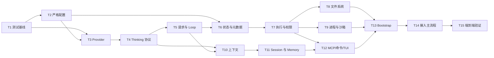

# ch10.5：总结重构 Tasks

## 执行原则

1. 严格按 T1 → T15 的 BFS 顺序推进；同一任务内先补行为测试，再修改实现。
2. 每个任务完成后依次运行：目标测试、受影响集成测试、全量非 live 回归；没有测试证据不得进入下一任务。
3. 迁移期间允许极短暂的兼容导出，但替代调用方完成后必须在 T14 删除；不得长期保留两套生产路径。
4. 不修改、不覆盖、不清理本次重构范围外的工作区改动和未跟踪文件。
5. 新增场景使用稳定 case ID；只有输入、路径、分支或可观察结果确实不同的参数化用例才计入数量。
6. 真实 DeepSeek、Seatbelt、MCP 和真实进程测试只按环境阻塞或真实失败报告，不因 API 成本跳过。

## 自动测试配额

下表是 ch10.5 新增独立场景的最低分配，不含现有 413 项基线。任务完成时必须通过收集脚本核对实际 case ID，不以测试函数数量估算。

| 任务 | 单元 | 确定性集成 | Property / 故障 | 真实集成 | Soak | 小计 |
|---|---:|---:|---:|---:|---:|---:|
| T1 | 0 | 0 | 10 | 0 | 0 | 10 |
| T2 | 45 | 5 | 8 | 0 | 0 | 58 |
| T3 | 65 | 15 | 12 | 5 | 0 | 97 |
| T4 | 40 | 10 | 8 | 0 | 0 | 58 |
| T5 | 55 | 15 | 5 | 0 | 5 | 80 |
| T6 | 40 | 10 | 5 | 0 | 0 | 55 |
| T7 | 60 | 20 | 8 | 0 | 0 | 88 |
| T8 | 60 | 15 | 10 | 0 | 0 | 85 |
| T9 | 35 | 15 | 10 | 5 | 5 | 70 |
| T10 | 50 | 15 | 10 | 0 | 5 | 80 |
| T11 | 55 | 20 | 8 | 0 | 5 | 88 |
| T12 | 45 | 10 | 3 | 5 | 0 | 63 |
| T13 | 0 | 15 | 3 | 0 | 5 | 23 |
| T14 | 0 | 15 | 0 | 3 | 5 | 23 |
| T15 | 0 | 0 | 0 | 2 | 0 | 2 |
| **合计** | **550** | **180** | **100** | **20** | **30** | **880** |

最终目标是至少 1293 个自动场景和 20 项手工场景。配额只设下限：发现新的高价值边界时继续增加，但不以无意义参数排列凑数。

## 文件变更总览

| 操作 | 主要文件或目录 | 目的 |
|---|---|---|
| 新建 | `artcode/bootstrap.py` | 唯一生产 Composition Root 与统一生命周期 |
| 新建 | `artcode/runtime/state.py` | 进程内权威可变状态与脱敏快照 |
| 新建 | `artcode/agent/request.py` | 请求估算、压缩、准备和发送前提交边界 |
| 新建 | `artcode/providers/deepseek.py` | DeepSeek 专用 Provider 与复用 HTTP Client |
| 新建 | `artcode/tools/execution.py` | 工具批次计划、权限协调、异常归一化 |
| 新建 | `artcode/tools/filesystem.py` | Workspace 路径、符号链接与原子文件提交 |
| 新建 | `artcode/tools/process.py` | 进程组启动、SIGKILL 与回收 |
| 新建 | `artcode/permissions/service.py` | 权限决策、审批和规则写入协调 |
| 新建 | `artcode/prompting/durable.py` | 固定规则、指令与长期记忆索引来源 |
| 新建 | `artcode/persistence/session_service.py` | 会话创建、锁、追加、恢复和清理 |
| 新建 | `artcode/persistence/memory_service.py` | 长期记忆单消费者队列与失败隔离 |
| 修改 | `artcode/config.py`、`artcode/conversation/context.py`、`artcode/agent/*` | 严格配置、Thinking 协议、无限循环和独立 User Entry |
| 修改 | `artcode/context_management/*` | 只压缩非 User 历史并保持原子提交 |
| 修改 | `artcode/tools/*`、`artcode/permissions/*`、`artcode/sandbox/*` | 单一工具元数据、执行前复核、权限和网络全拒绝 |
| 修改 | `artcode/mcp/*`、`artcode/commands/*`、`artcode/tui/*` | 显式上下文、状态纯读取和展示边界 |
| 修改 | `artcode/runtime/app.py`、`artcode/cli.py` | 只保留交互协调与参数解析 |
| 删除 | `artcode/providers/openai_compatible.py`、`artcode/agent/tools.py`、`artcode/persistence/coordinator.py` | 删除完成迁移后的旧生产路径 |
| 新建/迁移 | `tests/{fixtures,property,fault,live,soak,manual}` | 大规模共享测试基础设施与验收材料 |
| 修改 | `README.md`、`tests/integration/README.md`、四份 ch10.5 文档 | 让使用说明和架构事实与代码一致 |

## T1：建立测试基础设施与不可破坏基线

**影响文件：** `pyproject.toml`、`tests/conftest.py`、`tests/fixtures/`、`tests/property/`、`tests/fault/`、`tests/live/`、`tests/soak/`、`tests/manual/`、`tests/tools/verify_test_inventory.py`、`tests/tools/verify_coverage.py`、`tests/integration/README.md`

**依赖任务：** 无

**参考资料定位：** `spec.md` F40、F42、N5、N7～N12、AC12～AC13；`plan.md`“Wave 0：全域行为保护”“测试架构”。

**完成结果：** 后续所有任务共用同一套可复现 Fixture、分类标记、场景计数与覆盖检查；现有 413 项基线有机器可读证据。

**步骤：**

1. 记录当前 `pytest --collect-only`、全量非 live 结果和耗时，保存为测试基线说明，不修改既有断言。
2. 只在 test extra 中加入 Hypothesis 与 pytest-cov；注册 `live`、`slow`、`property`、`fault`、`soak` 标记和默认选择规则。
3. 建立共享 Fake Provider、任意分片 SSE、交错 Tool Delta、进程树、临时 Workspace、符号链接变化、损坏 JSONL、故障文件系统和 Fake MCP Fixture。
4. 为每类 Fixture 写契约自测，验证可重复、无真实目录污染、异步资源在失败后关闭。
5. 实现场景清单脚本：按目录和 marker 统计独立 pytest node ID，拒绝重复 case ID，输出相对基线的新增数量。
6. 实现覆盖检查脚本：同时校验全项目行/分支覆盖率和后续指定关键模块的分支覆盖率。
7. 把真实测试所需环境变量、可观察的环境阻塞条件和禁止用 API 成本跳过的规则写入测试 README。

**新增测试配额：** Property / 故障 10，专门验证 Fixture 与统计器本身；不把现有 413 项重复计入新增数量。

**验证：**

```text
.venv/bin/python -m pytest --collect-only -q
.venv/bin/python -m pytest -q -m "not live and not slow"
.venv/bin/python tests/tools/verify_test_inventory.py --baseline 413
```

期望现有基线全部通过、收集数不低于 413、每个新 marker 可单独收集，临时资源清理断言全部通过。

## T2：收紧配置并拆出纯配置状态

**影响文件：** `artcode/config.py`、`config.example.yml`、`artcode/runtime/state.py`、`artcode/tui/render.py`、`tests/unit/test_config.py`、`tests/unit/test_render.py`、`tests/property/test_config_properties.py`、`tests/integration/test_config_startup_flow.py`

**依赖任务：** T1

**参考资料定位：** `spec.md` F3～F9、F12、N3、AC1～AC3；`plan.md`“ArtCodeConfig”“RuntimeState”“配置”“Wave 1：配置与 Provider 合同”。

**完成结果：** 配置对象只表达配置；任意层级未知字段和错误 MCP 容器都确定失败；默认模型窗口与 Thinking 语义固定且可观察。

**步骤：**

1. 先补顶层、Provider、Context、Permission、Sandbox、Memory、MCP 多未知键和错误类型的失败先行测试。
2. 为每个配置段实现明确字段集合和层级路径；一次收集同层全部未知字段后产生稳定错误。
3. 让 MCP Server 容器类型错误直接失败，并保留单个 Server 内错误定位。
4. 固定 DeepSeek V4 Flash 0731 基线、默认完整 1M 上下文窗口和合法较小窗口校验；所有比例阈值只从配置窗口推导。
5. 将 Thinking 配置收敛为显式 enabled/disabled，启用时强度只能为 high；删除低、中档选择和隐式默认推断。
6. 把 `SafeConfigStatus` 中的运行信息迁入 `runtime/state.py` 的脱敏启动快照；配置层不导入 Session、Memory、Sandbox 或 TUI 状态。
7. 更新示例配置和错误提示，移除旧章节文件名，验证秘密值不出现在异常与状态面板。

**新增测试配额：** 单元 45、确定性集成 5、Property / 故障 8。

**验证：**

```text
.venv/bin/python -m pytest tests/unit/test_config.py tests/unit/test_render.py tests/property/test_config_properties.py tests/integration/test_config_startup_flow.py -q
.venv/bin/python -m pytest -q -m "not live and not slow"
```

期望合法配置结果确定，非法配置一次报告正确层级的全部字段，错误信息和状态展示不包含 API key。

## T3：建立 DeepSeek Provider 的类型化流协议

**影响文件：** `artcode/providers/base.py`、`artcode/providers/events.py`、`artcode/providers/deepseek.py`、`artcode/providers/sse.py`、`artcode/providers/tool_calls.py`、`artcode/providers/__init__.py`、`tests/unit/test_provider_events.py`、`tests/unit/test_sse.py`、`tests/unit/test_tool_calls.py`、`tests/unit/test_deepseek_provider.py`、`tests/property/test_sse_properties.py`、`tests/fault/test_provider_faults.py`、`tests/integration/test_provider_flow.py`、`tests/live/test_deepseek_provider_live.py`

**依赖任务：** T1、T2

**参考资料定位：** `spec.md` F8～F13、F17、F22、N5～N6、AC2～AC3；`plan.md`“ProviderRequest”“Provider 流事件”“DeepSeek Provider”“Wave 1”。

**完成结果：** Provider 使用明确请求对象和事件联合类型；文本、推理、工具、usage 与 finish 不再靠松散字典跨层猜测；HTTP Client 在应用生命周期内复用。

**步骤：**

1. 定义 `ProviderRequest`、`ContentDelta`、`ReasoningDelta`、`ToolCallsCompleted`、`UsageReported`、`StreamCompleted` 及穷尽处理测试。
2. 将 SSE framing 与业务事件解析分离，覆盖任意字节边界、CRLF、空行、多 data 行、错误 JSON、断流和 `[DONE]`。
3. 让 Tool call 组装器按 index 处理交错名称与参数增量，非法序列映射为稳定 Provider 错误。
4. 新建 DeepSeek 专用适配器；请求中 Thinking off 显式关闭，Thinking on 只发送 high；继续使用已验证的流式对话协议。
5. 接收并发出 reasoning content，完整保留 finish reason 和服务端 usage；`length` 只表达完成原因，不修改文本。
6. 注入并复用单个 `httpx.AsyncClient`，明确谁创建、谁关闭；覆盖启动失败、正常关闭、请求取消和重复请求的连接生命周期。
7. 统一认证、限流、上下文、HTTP、SSE 与取消错误分类，验证 URL、headers、body 和错误消息都不泄露秘密。
8. 运行真实 DeepSeek：Thinking off、Thinking high、usage、length/上下文错误和流取消，保存脱敏证据。

**新增测试配额：** 单元 65、确定性集成 15、Property / 故障 12、真实集成 5。

**验证：**

```text
.venv/bin/python -m pytest tests/unit/test_provider_events.py tests/unit/test_sse.py tests/unit/test_tool_calls.py tests/unit/test_deepseek_provider.py tests/property/test_sse_properties.py tests/fault/test_provider_faults.py tests/integration/test_provider_flow.py -q
.venv/bin/python -m pytest tests/live/test_deepseek_provider_live.py -q -rs
.venv/bin/python -m pytest -q -m "not live and not slow"
```

期望确定性测试全过，真实五类场景逐项报告通过或真实外部失败，任何输出不含 API key。

## T4：补齐 Conversation 与 Session 的 Thinking 协议

**影响文件：** `artcode/conversation/context.py`、`artcode/agent/events.py`、`artcode/agent/stream.py`、`artcode/persistence/models.py`、`artcode/persistence/sessions.py`、`tests/unit/test_provider_events.py`、`tests/unit/test_agent_stream.py`、`tests/unit/test_session_journal.py`、`tests/property/test_conversation_protocol_properties.py`、`tests/integration/test_thinking_tool_roundtrip.py`

**依赖任务：** T1、T3

**参考资料定位：** `spec.md` F10～F11、F17～F18、F22、F35～F36、AC3、AC5、AC10；`plan.md`“ModelTurn”“CompletedTurn”“Conversation、Prompt 与 RequestPreparer”。

**完成结果：** `ModelTurn` 能完整表达 reasoning、文本、工具调用和 finish；带工具调用的 Assistant 消息经过内存、JSONL 和恢复后仍满足 DeepSeek 续接协议。

**步骤：**

1. 先写类型化流事件到 `ModelTurn` 的状态转换测试，覆盖交错 reasoning/content、工具调用、usage、length、断流和取消。
2. 在 Assistant 消息模型中显式保存 reasoning content；User 消息结构保持独立且原文不变。
3. 将 `AgentRunResult` 替换为 `CompletedTurn` 的最小必要数据，确保只有自然完成轮次可进入后续记忆路径。
4. 更新 JSONL 编解码，新增字段向后兼容缺失；新写记录能无损恢复 reasoning content 与 finish reason。
5. 对取消和流错误实现“只展示、不追加”约束；若工具调用已经确定，生成结构化中断结果维持协议完整。
6. 用属性测试生成不同 User/Assistant/Tool 组合，检查保存—恢复等价、User 数量/原文/顺序不变和工具协议安全前缀。
7. 建立确定性连续 Thinking 工具调用回放，证明第二次 Provider 请求带齐服务端要求字段。

**新增测试配额：** 单元 40、确定性集成 10、Property / 故障 8。

**验证：**

```text
.venv/bin/python -m pytest tests/unit/test_agent_stream.py tests/unit/test_session_journal.py tests/property/test_conversation_protocol_properties.py tests/integration/test_thinking_tool_roundtrip.py -q
.venv/bin/python -m pytest -q -m "not live and not slow"
```

期望保存—恢复后协议结构等价，取消/断流的半截 Assistant 不进入 Conversation 或 JSONL。

## T5：纯化请求组装并取消默认 Agent 轮数上限

**影响文件：** `artcode/prompting/assembler.py`、`artcode/prompting/reminder.py`、`artcode/agent/request.py`、`artcode/agent/loop.py`、`artcode/agent/stream.py`、`tests/unit/test_prompt_assembler.py`、`tests/unit/test_system_reminder.py`、`tests/unit/test_agent_loop.py`、`tests/unit/test_context_agent_integration.py`、`tests/fault/test_request_preparation_faults.py`、`tests/integration/test_agent_request_flow.py`、`tests/soak/test_unlimited_agent_loop.py`

**依赖任务：** T1、T3、T4

**参考资料定位：** `spec.md` F5、F14～F17、F20～F22、N3、AC1、AC4～AC5；`plan.md`“PromptRequest”“PreparedModelRequest”“AgentRunRequest”“Conversation、Prompt 与 RequestPreparer”“Wave 2”。

**完成结果：** Prompt Assembler 是无状态纯组装器；提醒只在首次真实发送时提交；正常 Agent Loop 默认无限，测试可显式有限。

**步骤：**

1. 为相同输入重复组装、状态查询、Token 估算、压缩前试组装和发送前失败补充无副作用测试。
2. 让 Assembler 只接收显式 `PromptRequest` 并返回请求消息，不读取或消费 Reminder、Runtime 或 Session 私有状态。
3. 新建 `RequestPreparer`，依次协调 durable prompt、conversation snapshot、估算、轻量工具结果存盘、重量摘要与一次有限超限重试。
4. 将恢复提醒拆为 peek/commit 语义；仅 Provider 调用真正开始后提交，准备失败或 preview 不提交。
5. 把 `AgentRunRequest.max_iterations` 设为 `int | None` 且默认 `None`；显式正整数用于测试和自动化，非法值立即拒绝。
6. 明确循环终止集合：自然完成、用户取消、Provider/请求失败和确定不可继续；不增加重复工具检测、启发式停止或自动续写。
7. `finish_reason=length` 保留实际文本并正常结束当前轮，不写额外标记、不自动发起下一请求。
8. Soak 覆盖超过 12 轮、长工具链、显式上限、取消和失败终止，检查无递归增长与无提醒重复消费。

**新增测试配额：** 单元 55、确定性集成 15、Property / 故障 5、Soak 5。

**验证：**

```text
.venv/bin/python -m pytest tests/unit/test_prompt_assembler.py tests/unit/test_system_reminder.py tests/unit/test_agent_loop.py tests/unit/test_context_agent_integration.py tests/fault/test_request_preparation_faults.py tests/integration/test_agent_request_flow.py -q
.venv/bin/python -m pytest tests/soak/test_unlimited_agent_loop.py -q -m soak
.venv/bin/python -m pytest -q -m "not live and not slow"
```

期望超过旧轮数继续运行、显式上限确定停止、所有 preview 调用前后状态完全相同。

## T6：统一 RuntimeState 与 ToolDescriptor

**影响文件：** `artcode/runtime/state.py`、`artcode/tools/base.py`、`artcode/tools/registry.py`、`artcode/tools/policy.py`、`artcode/agent/modes.py`、`artcode/agent/loop.py`、`artcode/tui/render.py`、`tests/unit/test_runtime_state.py`、`tests/unit/test_tool_registry.py`、`tests/unit/test_tool_policy.py`、`tests/unit/test_agent_modes.py`、`tests/property/test_tool_descriptor_properties.py`、`tests/integration/test_runtime_tool_metadata_flow.py`

**依赖任务：** T1、T2、T5

**参考资料定位：** `spec.md` F3～F5、F23、F29、F32～F34、N2～N4、AC1、AC6、AC9；`plan.md`“RuntimeState”“ToolEnvironment”“ToolDescriptor”“Runtime 与终端状态”“Wave 3”。

**完成结果：** 权限、Shell 策略、显示模式和 usage 各有唯一权威状态；工具只声明一次来源和副作用分类，即可驱动模式、批次与权限策略。

**步骤：**

1. 用状态一致性测试定位当前重复的 Permission/Shell/Display/usage 来源和 Runtime 动态兜底。
2. 完成 `RuntimeState`，持有唯一 `PermissionState`、显示模式、最近 usage，并只暴露不可变脱敏快照。
3. 将 `ToolEnvironment` 收敛为稳定资源，将请求级 mode、permission snapshot 等移入显式 `ToolRunContext`。
4. 定义 `ToolDescriptor`、`ToolEffect`、origin 和 rule-configurable；Registry 成为元数据唯一注册中心。
5. 让 Plan 模式过滤、并发批次规划与权限分类都读取 Descriptor，不再维护重复工具名集合。
6. 增加一个测试工具，只声明一次元数据，证明三条策略链都自动生效。
7. `/status` 与 TUI 只读取 RuntimeState 快照；删除读取配置默认副本或修改冻结 Context 的同步方式。

**新增测试配额：** 单元 40、确定性集成 10、Property / 故障 5。

**验证：**

```text
.venv/bin/python -m pytest tests/unit/test_runtime_state.py tests/unit/test_tool_registry.py tests/unit/test_tool_policy.py tests/unit/test_agent_modes.py tests/property/test_tool_descriptor_properties.py tests/integration/test_runtime_tool_metadata_flow.py -q
.venv/bin/python -m pytest -q -m "not live and not slow"
```

期望元数据只在 Registry/Tool 定义处出现，切换状态后执行与展示在同一轮读取相同值。

## T7：收敛工具执行与权限服务

**影响文件：** `artcode/tools/execution.py`、`artcode/permissions/service.py`、`artcode/permissions/engine.py`、`artcode/permissions/models.py`、`artcode/permissions/rules.py`、`artcode/permissions/writer.py`、`artcode/tools/results.py`、`artcode/agent/loop.py`、`tests/unit/test_tool_execution.py`、`tests/unit/test_permission_engine.py`、`tests/unit/test_permission_rules.py`、`tests/unit/test_permission_writer.py`、`tests/property/test_permission_properties.py`、`tests/fault/test_tool_execution_faults.py`、`tests/integration/test_permissions_flow.py`、`tests/integration/test_tool_batch_flow.py`

**依赖任务：** T1、T6

**参考资料定位：** `spec.md` F23～F24、F29、F32、N3、N6、AC6、AC8～AC9；`plan.md`“工具执行、权限、文件与进程”“PermissionService”“Wave 3”。

**完成结果：** `ToolExecutionService` 统一完成查找、模式检查、参数校验、权限、执行与异常归一化；权限四种选择保持原行为且不再散落在 Agent/TUI。

**步骤：**

1. 先为未知工具、模式禁止、非法参数、审批拒绝、规则拒绝、执行异常、同批部分失败和取消补失败先行测试。
2. 新建 `PermissionService`，组合规则匹配、一次性审批、永久 allow/deny 写入和唯一 `PermissionState`，不改变用户可见四种选择。
3. 新建 `ToolExecutionService`，按 Descriptor 生成执行批次并为每次调用构造显式 `ToolRunContext`。
4. 将所有已知拒绝与异常映射为稳定结构化 `ToolResult`；捕获单工具意外异常但保留同批已完成结果。
5. 保证批次结果按原 Tool call 顺序回填，即使内部安全并发完成顺序不同。
6. 把 Agent Loop 中的执行策略迁出，只保留“提交调用—接收结果—推进下一轮”的状态机职责。
7. 用 Permission glob 属性测试覆盖转义、路径/命令模式、优先级、持久规则往返和写失败原子性。
8. 清除未使用 approval 字段和 `PreparedToolExecution` 的生产调用方，类型本体留到 T14 统一删除。

**新增测试配额：** 单元 60、确定性集成 20、Property / 故障 8。

**验证：**

```text
.venv/bin/python -m pytest tests/unit/test_tool_execution.py tests/unit/test_permission_engine.py tests/unit/test_permission_rules.py tests/unit/test_permission_writer.py tests/property/test_permission_properties.py tests/fault/test_tool_execution_faults.py tests/integration/test_permissions_flow.py tests/integration/test_tool_batch_flow.py -q
.venv/bin/python -m pytest -q -m "not live and not slow"
```

期望所有错误均返回结构化结果，同批成功结果不丢失，权限规则和用户选择与重构前一致。

## T8：集中 Workspace 路径与原子文件操作

**影响文件：** `artcode/tools/filesystem.py`、`artcode/tools/file_tools.py`、`artcode/tools/policy.py`、`artcode/workspace.py`、`tests/unit/test_workspace_file_access.py`、`tests/unit/test_file_tools.py`、`tests/property/test_workspace_paths.py`、`tests/fault/test_atomic_file_writes.py`、`tests/integration/test_workspace_file_flow.py`

**依赖任务：** T1、T6、T7

**参考资料定位：** `spec.md` F25～F27、N5、N8、AC7；`plan.md`“WorkspaceFileAccess”“工具执行、权限、文件与进程”“Wave 3”。

**完成结果：** 所有文件工具走同一个 `WorkspaceFileAccess`；准备和执行时都基于当前实际目标复核；合法内部 symlink 可用，越界/敏感/目标变化拒绝。

**步骤：**

1. 建立路径矩阵：相对路径、`.`/`..`、不存在父目录、Workspace 内/外 symlink、敏感路径、审批期间链接替换和竞态错误。
2. 将 Workspace 边界、敏感范围和解析结果集中到 `WorkspaceFileAccess`，删除 `AllowedPathPolicy` 调用方。
3. 在权限展示前准备目标快照，在真正 read/write/edit 前重新解析并比较安全语义；目标变化返回结构化拒绝。
4. 写新文件时只在 Workspace 内创建缺失父目录；任一步失败都不留下越界目录或半文件。
5. 用同目录临时文件、flush、fsync、原子 replace 完成覆盖与编辑提交，并在失败路径清理临时文件。
6. 保留现有语义：默认不覆盖已有文件；精确编辑必须唯一命中；零次/多次命中不修改磁盘。
7. 用 Hypothesis 组合路径片段、Unicode、符号链接和敏感边界，断言最终真实路径不越权。

**新增测试配额：** 单元 60、确定性集成 15、Property / 故障 10。

**验证：**

```text
.venv/bin/python -m pytest tests/unit/test_workspace_file_access.py tests/unit/test_file_tools.py tests/property/test_workspace_paths.py tests/fault/test_atomic_file_writes.py tests/integration/test_workspace_file_flow.py -q
.venv/bin/python -m pytest -q -m "not live and not slow"
```

期望合法多级目录和内部 symlink 成功；所有越界、敏感和 TOCTOU 场景拒绝且磁盘无部分修改。

## T9：统一进程组、强制取消与网络全拒绝沙箱

**影响文件：** `artcode/tools/process.py`、`artcode/tools/command_tool.py`、`artcode/sandbox/seatbelt.py`、`artcode/sandbox/seatbelt.sb`、`artcode/security/commands.py`、`tests/unit/test_process_supervisor.py`、`tests/unit/test_command_tool.py`、`tests/unit/test_seatbelt.py`、`tests/fault/test_process_tree_faults.py`、`tests/integration/test_process_flow.py`、`tests/live/test_process_and_seatbelt_live.py`、`tests/soak/test_process_cleanup.py`

**依赖任务：** T1、T6、T7

**参考资料定位：** `spec.md` F28～F30、N5～N6、N8、AC8；`plan.md`“ProcessSupervisor”“工具执行、权限、文件与进程”“Ctrl+C 取消命令”“Wave 3”。

**完成结果：** 每条 Shell 命令在独立进程组运行；timeout 和取消都对整个组直接 SIGKILL 并 await 回收；Seatbelt 以单一策略表达网络全部禁止。

**步骤：**

1. 用真实 Fixture 建立父进程、子进程、孙进程、忽略普通信号、持续输出和退出竞态矩阵。
2. 新建 `ProcessSupervisor`，集中创建新进程组、stdout/stderr 收集、timeout、取消、SIGKILL 和 `wait()`。
3. 对 timeout 与 `CancelledError` 使用同一幂等终止路径；处理“刚好退出”“kill 时不存在”和读取任务仍未结束”的竞态。
4. CommandTool 只负责参数、策略和结构化结果，不直接拥有进程生命周期细节。
5. 将 Seatbelt 网络策略集中为公网、回环、DNS、本地监听和子进程继承全部拒绝；不增加域名代理或交互式网络放行。
6. 真实验证 PID/PGID 在命令返回后全部不存在，文件描述符和异步任务无泄漏。
7. Soak 重复运行成功、timeout、取消和高输出命令，监测残留进程、任务与资源增长。

**新增测试配额：** 单元 35、确定性集成 15、Property / 故障 10、真实集成 5、Soak 5。

**验证：**

```text
.venv/bin/python -m pytest tests/unit/test_process_supervisor.py tests/unit/test_command_tool.py tests/unit/test_seatbelt.py tests/fault/test_process_tree_faults.py tests/integration/test_process_flow.py -q
.venv/bin/python -m pytest tests/live/test_process_and_seatbelt_live.py -q -rs
.venv/bin/python -m pytest tests/soak/test_process_cleanup.py -q -m soak
.venv/bin/python -m pytest -q -m "not live and not slow"
```

期望 timeout/取消后所有后代 PID 消失，网络五类场景全部失败，正常命令输出语义保持不变。

## T10：重写上下文保留计划并永久保留 User 原文

**影响文件：** `artcode/context_management/models.py`、`artcode/context_management/retention.py`、`artcode/context_management/summarizer.py`、`artcode/context_management/manager.py`、`artcode/context_management/lightweight.py`、`artcode/context_management/artifacts.py`、`artcode/context_management/estimator.py`、`artcode/conversation/context.py`、`tests/unit/test_context_*.py`、`tests/property/test_context_retention_properties.py`、`tests/fault/test_context_commit_faults.py`、`tests/integration/test_context_management_flow.py`、`tests/soak/test_repeated_context_compaction.py`

**依赖任务：** T1、T4、T5

**参考资料定位：** `spec.md` F18～F21、F35～F36、N3、N5、AC5、AC10；`plan.md`“上下文压缩”“Wave 4：上下文、Session 与 Memory”。

**完成结果：** 每条 User 消息在任何压缩次数后仍以独立 `role=user` 原文、原数量和原顺序存在；只有旧 Assistant、Tool 和内部 System 历史可被摘要替换。

**步骤：**

1. 用生成式序列先固定不变量：User Entry 身份/文本/顺序不变，工具协议闭合，摘要失败不提交，重复压缩结果确定。
2. 让 RetentionPlan 明确区分固定 System、摘要、历史标记、旧 User 原文、边界和近期历史；不得把 User 文本塞进单一摘要消息代替原文。
3. 调整摘要格式，使其引用但不替代独立 User 消息；程序按原顺序重新注入对应用户原文。
4. 只对 Assistant、Tool、内部 System 应用轻量存盘和重量摘要；移除超大 User 消息专用预检、回滚和特殊状态。
5. 保证摘要生成、artifact 写入和 Conversation 替换为原子提交；模型、解析、磁盘或取消失败保持原快照。
6. 保持 Provider 超限时最多一次普通压缩重试；不可压缩 User 原文仍超限则让 Provider 错误正常返回。
7. Soak 进行多轮工具存盘与重量压缩，逐轮检查用户原文哈希、消息计数、工具协议和临时 artifact 清理。

**新增测试配额：** 单元 50、确定性集成 15、Property / 故障 10、Soak 5。

**验证：**

```text
.venv/bin/python -m pytest tests/unit/test_context_*.py tests/property/test_context_retention_properties.py tests/fault/test_context_commit_faults.py tests/integration/test_context_management_flow.py -q
.venv/bin/python -m pytest tests/soak/test_repeated_context_compaction.py -q -m soak
.venv/bin/python -m pytest -q -m "not live and not slow"
```

期望所有随机序列和重复压缩中 User 原文哈希、数量、顺序完全一致，失败注入后 Conversation 未变化。

## T11：拆分 Session、Durable Prompt 与 Memory 服务

**影响文件：** `artcode/persistence/session_service.py`、`artcode/persistence/memory_service.py`、`artcode/persistence/sessions.py`、`artcode/persistence/updater.py`、`artcode/persistence/notes.py`、`artcode/persistence/instructions.py`、`artcode/persistence/paths.py`、`artcode/persistence/models.py`、`artcode/prompting/durable.py`、`artcode/prompting/reminder.py`、`tests/unit/test_session_*.py`、`tests/unit/test_memory_*.py`、`tests/unit/test_persistence_prompt_integration.py`、`tests/property/test_session_recovery_properties.py`、`tests/fault/test_memory_service_faults.py`、`tests/integration/test_persistence_flow.py`、`tests/integration/test_memory_flow.py`、`tests/soak/test_session_memory_lifecycle.py`

**依赖任务：** T1、T4、T5、T10

**参考资料定位：** `spec.md` F16、F35～F39、N5～N6、N8、AC10～AC11；`plan.md`“Session、Prompt Source 与 Memory”“CompletedTurn”“Wave 4”。

**完成结果：** Session、固定提示来源和长期记忆三个生命周期彼此独立；JSONL v1、Markdown Note 与索引格式兼容；记忆失败不污染当前 Agent。

**步骤：**

1. 新建 `SessionService`，集中新建、按 ID 恢复、默认恢复、锁定、同步追加、扫描、过期清理和关闭；底层 JSONL 编解码仍留在 `sessions.py`。
2. 实现恢复判定：完整独立坏行跳过并警告；不完整尾部截断；破坏 Tool 协议时仅保留安全前缀；前后安全 User 原文均不改写。
3. 保持双进程不能追加同一 Session，默认冲突时创建新会话，正常/异常退出都释放锁。
4. 新建 `DurablePromptSource`，只读取固定规则、项目/用户指令、长期记忆索引，不拥有 Conversation 或一次性提醒状态。
5. 新建 `MemoryService` 单消费者后台队列，只接收自然完成 `CompletedTurn` 的不可变副本，按顺序更新用户级/项目级 Note 与索引。
6. 隔离记忆超时、Provider、解析、存储和关闭取消；失败只产生状态报告，不改 Conversation、JSONL、当前回复或 Agent 控制流。
7. 对 JSONL 坏行/大行/截断/协议组和记忆重复事实/索引重建做 Property 与故障注入。
8. Soak 重复恢复、追加、轮转、队列处理和关闭，检查锁、任务、文件句柄、临时文件及消息顺序。

**新增测试配额：** 单元 55、确定性集成 20、Property / 故障 8、Soak 5。

**验证：**

```text
.venv/bin/python -m pytest tests/unit/test_session_*.py tests/unit/test_memory_*.py tests/unit/test_persistence_prompt_integration.py tests/property/test_session_recovery_properties.py tests/fault/test_memory_service_faults.py tests/integration/test_persistence_flow.py tests/integration/test_memory_flow.py -q
.venv/bin/python -m pytest tests/soak/test_session_memory_lifecycle.py -q -m soak
.venv/bin/python -m pytest -q -m "not live and not slow"
```

期望坏独立记录前后的安全记录都恢复，锁互斥成立，所有记忆失败路径对当前请求无副作用。

## T12：让 MCP、命令与 TUI 只依赖显式边界

**影响文件：** `artcode/mcp/manager.py`、`artcode/mcp/session.py`、`artcode/mcp/adapter.py`、`artcode/mcp/transport.py`、`artcode/mcp/results.py`、`artcode/commands/base.py`、`artcode/commands/builtin.py`、`artcode/commands/dispatcher.py`、`artcode/tui/app.py`、`artcode/tui/render.py`、`artcode/tui/keybindings.py`、`artcode/runtime/app.py`、`tests/unit/test_mcp_*.py`、`tests/unit/test_commands.py`、`tests/unit/test_tui_app.py`、`tests/unit/test_render.py`、`tests/property/test_mcp_isolation_properties.py`、`tests/integration/test_mcp_agent_flow.py`、`tests/integration/test_command_flow.py`、`tests/live/test_mcp_live.py`

**依赖任务：** T1、T5～T7、T11

**参考资料定位：** `spec.md` F5、F31～F34、N4、N6、AC1、AC9；`plan.md`“MCP、命令和 TUI”“/status”“关键模块交互”“Wave 5”。

**完成结果：** MCP 继续使用健康的 Manager/Session/Adapter 边界；Plan mode 通过 `ToolRunContext` 传递；命令与 TUI 只做分发、输入、展示和人工确认。

**步骤：**

1. 保留 MCP 现有分层，只修复配置失败、连接失败、工具名冲突、超时、取消和关闭时的服务级隔离。
2. MCP 工具统一注册为 EXTERNAL/可能有副作用，继续逐次人工确认；Adapter 不读取执行器隐藏 mode 字段。
3. 证明一个 MCP Server 失败或工具冲突时，内置工具和其他正常 Server 仍可发现和调用。
4. 命令继续走 Registry/Parser/Dispatcher，不增加命令；`/status` 只读取 RuntimeState 和各服务的脱敏快照。
5. 连续执行 `/status`，断言 Provider 调用、Conversation、Reminder、Context anchor、Session 文件和 Memory 队列均不变。
6. TUI 只消费展示事件并提供审批结果；移除业务服务对 Rich Renderer 细节和 Runtime 动态 `getattr` 兼容的依赖。
7. 真实 stdio/HTTP MCP 分别测试发现、调用、timeout、取消、断线、headers/重定向脱敏和确定关闭。

**新增测试配额：** 单元 45、确定性集成 10、Property / 故障 3、真实集成 5。

**验证：**

```text
.venv/bin/python -m pytest tests/unit/test_mcp_*.py tests/unit/test_commands.py tests/unit/test_tui_app.py tests/unit/test_render.py tests/property/test_mcp_isolation_properties.py tests/integration/test_mcp_agent_flow.py tests/integration/test_command_flow.py -q
.venv/bin/python -m pytest tests/live/test_mcp_live.py -q -rs
.venv/bin/python -m pytest -q -m "not live and not slow"
```

期望单 Server 故障被隔离、Plan 信息显式传递、所有命令回归通过、状态查询零副作用。

## T13：建立唯一 Bootstrap 与统一资源生命周期

**影响文件：** `artcode/bootstrap.py`、`artcode/cli.py`、`artcode/runtime/app.py`、`artcode/runtime/state.py`、`artcode/__main__.py`、各资源类型的 `close`/异步上下文边界、`tests/fault/test_bootstrap_lifecycle_faults.py`、`tests/integration/test_bootstrap_flow.py`、`tests/integration/test_runtime_flow.py`、`tests/soak/test_application_lifecycle.py`

**依赖任务：** T2、T3、T6、T8、T9、T11、T12

**参考资料定位：** `spec.md` F1～F5、F12、N3～N4、N6、AC1；`plan.md`“CLI 与 Bootstrap”“启动与关闭”“Wave 5：Bootstrap、Runtime 与资源生命周期”。

**完成结果：** `bootstrap.py` 是唯一生产依赖组装入口；CLI 只做 argparse 与退出码；Runtime 不再隐式创建第二套组件；所有资源由 AsyncExitStack 按确定顺序关闭。

**步骤：**

1. 用构造计数和关闭顺序 Spy 固定正常启动、阶段性失败、正常退出、Ctrl+C 与关闭异常五类生命周期。
2. 新建 Bootstrap：解析后的 AppOptions 与严格 Config 作为输入，集中创建 HTTP Client、SessionService、MemoryService、MCP、Sandbox、Tool Registry、Agent、Runtime 和 TUI。
3. 每创建一个需要关闭的资源立即登记 AsyncExitStack；后续启动失败只关闭已经创建的资源，且每个资源只关闭一次。
4. CLI 只保留 argparse、调用 Bootstrap 和稳定退出码映射，不加载业务状态或手工重复清理。
5. Runtime 构造函数改为完全显式依赖，只协调输入循环、命令/普通请求分流和展示事件，不创建生产 Provider、Persistence 或 Tools。
6. 删除运行时强改冻结 Context、重复 PermissionState/Shell mode 和动态 Fake 兼容分支的调用方。
7. Soak 重复冷启动、立即退出、启动失败和取消，检查任务、客户端、MCP 会话、锁与临时资源均回到零。

**新增测试配额：** 确定性集成 15、Property / 故障 3、Soak 5。

**验证：**

```text
.venv/bin/python -m pytest tests/fault/test_bootstrap_lifecycle_faults.py tests/integration/test_bootstrap_flow.py tests/integration/test_runtime_flow.py -q
.venv/bin/python -m pytest tests/soak/test_application_lifecycle.py -q -m soak
.venv/bin/python -m pytest -q -m "not live and not slow"
```

期望所有路径只组装一次、关闭顺序确定、无重复 close、无锁/任务/客户端残留，CLI 最简启动仍可用。

## T14：接入主流程

**影响文件：** `artcode/__init__.py`、`artcode/__main__.py`、`artcode/cli.py`、`artcode/bootstrap.py`、`artcode/runtime/app.py`、各包 `__init__.py`、全部受影响测试导入、`artcode/providers/openai_compatible.py`、`artcode/agent/tools.py`、`artcode/persistence/coordinator.py`、`README.md`、`tests/integration/README.md`、`spec汇总/ch10.5/plan.md`

**依赖任务：** T2～T13

**参考资料定位：** `spec.md` F40～F41、F44、N1～N4、N10～N12、AC12、AC15；`plan.md`“架构概览”“文件组织”“Wave 6：兼容层删除与全域验收”。

**完成结果：** 所有生产调用方只走新架构；旧模块、旧类型、重复集合和章节文本已删除；最简启动、`--resume` 与既有命令仍从同一主流程工作。

**步骤：**

1. 逐入口接通 `__main__ → cli → bootstrap → runtime → agent/request/provider/tools/persistence`，对每层只保留一个生产路径。
2. 迁移所有包导出、测试 Fake 与类型引用，运行导入图检查，确认基础设施不反向控制 TUI 或 Agent Loop。
3. 删除 `openai_compatible.py`、`agent/tools.py`、`persistence/coordinator.py` 及其仅兼容导出。
4. 删除 `AllowedPathPolicy`、`SafeConfigStatus`、`AgentRunResult`、`PreparedToolExecution`、重复 READ/WRITE/SIDE_EFFECT 集合、未使用 approval 字段和 Runtime `getattr` 兼容分支。
5. 搜索并删除生产文本中的 ch03/ch05/ch06/ch09/ch10 章节编号；错误提示只指向当前真实配置位置。
6. 验证默认启动、显式 `--resume`、显式 Session ID、新会话、Plan/Do、工具、MCP 和退出都经过唯一 Bootstrap。
7. 更新 README、测试说明和 Plan 架构图，使文件名、依赖方向、启动参数、虚拟环境用法和网络全拒绝 TODO 与实际代码一致。
8. 构建 wheel，在临时虚拟环境安装后执行最简 `artcode` 启动/退出与 `python -m artcode` 等价性测试。

**新增测试配额：** 确定性集成 15、真实集成 3、Soak 5。

**验证：**

```text
.venv/bin/python -m pytest tests/integration -q -m "not live and not slow"
.venv/bin/python -m pytest tests/live -q -k "bootstrap or cli or resume" -rs
.venv/bin/python -m pytest tests/soak -q -m soak
.venv/bin/python -m build
rg -n "openai_compatible|agent\.tools|persistence\.coordinator|AllowedPathPolicy|SafeConfigStatus|AgentRunResult|PreparedToolExecution|ch03|ch05|ch06|ch09|ch10" artcode tests
```

期望主流程测试与构建通过；最后一条搜索对生产兼容实现和章节产品文本零命中，测试名称中的历史回归说明必须有明确保留理由。

## T15：端到端验证

**影响文件：** `tests/tools/verify_test_inventory.py`、`tests/tools/verify_coverage.py`、`tests/live/`、`tests/soak/`、`tests/manual/ch10_5_acceptance.md`、`tests/manual/ch10_5_results.md`、`README.md`、`tests/integration/README.md`、`spec汇总/ch10.5/spec.md`、`spec汇总/ch10.5/plan.md`、`spec汇总/ch10.5/tasks.md`、`spec汇总/ch10.5/checklist.md`

**依赖任务：** T14

**参考资料定位：** `spec.md` F42～F44、N7～N12、AC13～AC15；`plan.md`“测试架构”“二十项手工测试”“技术决策”。

**完成结果：** 至少 1293 个自动场景完成收集与分类，覆盖门槛达标，全部真实/Soak 测试有证据；用户亲自完成并记录恰好 20 项复杂手工验收；最终文档与代码一致。

**步骤：**

1. 用收集脚本核对：ch10.5 新增单元 ≥550、确定性集成 ≥180、Property/故障 ≥100、真实集成 ≥20、Soak ≥30、新增合计 ≥880、最终总数 ≥1293。
2. 运行全项目 coverage：行覆盖率 ≥95%、分支覆盖率 ≥90%；Config、Provider payload/SSE、Conversation、Retention、Session Recovery、Permission、WorkspaceFileAccess、ProcessSupervisor 分支覆盖率分别 ≥95%。
3. 执行全部确定性测试、Property、故障注入和 Soak；保存命令、时间、版本、收集数、通过/失败和耗时。
4. 执行全部真实 DeepSeek、Seatbelt、Process、MCP stdio/HTTP 与双进程 Session 测试；外部失败单独报告并保留脱敏证据，环境阻塞不得记为通过。
5. 在 `tests/manual/ch10_5_acceptance.md` 固定恰好 20 项：冷启动、严格配置、Thinking off、Thinking tools、超过十二轮、Ctrl+C、命令超时、多级目录、符号链接变化、权限四类选择、网络沙箱、敏感文件、Plan/Do、MCP stdio、MCP HTTP、上下文压缩、恢复提醒、损坏会话、双进程锁、长期记忆隔离。
6. 每项手工场景写明临时 HOME/Workspace 准备、真实 TUI 输入/确认、可观察结果、失败证据和不触碰真实用户目录的清理命令。
7. 由用户亲自逐项执行；在 `ch10_5_results.md` 记录通过、失败或阻塞。任何未执行或失败项不得写成完成。
8. 对照实际导入图、文件树、CLI help 和测试命令复核 README、测试说明、四份 ch10.5 文档和架构图，修正所有过时描述。
9. 最后再运行一次 wheel 构建和全量自动测试，确认验收记录之外没有未提交的临时测试产物或对用户文件的修改。

**新增测试配额：** 真实集成 2；其余工作负责核清前 14 个任务的 878 项配额并完成 20 项手工验收，不新增无意义用例凑数。

**验证：**

```text
.venv/bin/python tests/tools/verify_test_inventory.py --baseline 413 --unit-min 550 --integration-min 180 --property-fault-min 100 --live-min 20 --soak-min 30 --total-min 1293
.venv/bin/python -m pytest tests/unit tests/integration tests/property tests/fault -q -m "not live and not slow" --cov=artcode --cov-branch --cov-report=term-missing
.venv/bin/python tests/tools/verify_coverage.py
.venv/bin/python -m pytest tests/soak -q -m soak
.venv/bin/python -m pytest tests/live -q -m live -rs
.venv/bin/python -m pytest -q
.venv/bin/python -m build
```

期望数量、覆盖、确定性、Soak、真实集成和构建全部满足 Checklist；20 项手工结果逐项有用户记录。真实外部失败或环境阻塞存在时，保留为未完成项并明确列出，不伪报完成。

## 任务依赖图



实现时仍按编号串行推进。图中的并行分支仅说明依赖关系，不授权跳过前序任务或同时深挖多个子系统。
