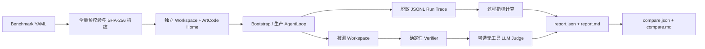

# ch11：Agent 评测与审计闭环 Plan

## 总体方案

本章在现有生产主链路外增加一个 `artcode-eval` 入口。它负责读取 Benchmark、复制隔离工作区、调用 `Bootstrap.build()` 组装出的真实 `AgentLoop`、记录事件、运行独立 Verifier、可选调用无工具 Judge，并将结果写成可比较报告。交互式 `artcode` 入口与原有 Agent 组装方式保持不变。

评测的证据链固定为：



成功判定只由运行状态与必选确定性 Verifier 决定。Judge 分数独立展示，不能把失败尝试改成通过。权限和上下文指标从 Trace 计算，不从最终回答猜测。

## 目录与依赖方向

新增目录：

```text
artcode/evaluation/
├── __init__.py        # 稳定公共模型与入口导出
├── __main__.py        # python -m artcode.evaluation
├── cli.py             # validate / run / compare
├── models.py          # Benchmark、Trace、Verifier、Report 数据模型
├── manifest.py        # YAML 解析、严格校验、路径解析、指纹
├── redaction.py       # 有界文本、秘密识别和稳定摘要
├── trace.py           # AgentEvent -> JSONL Trace 与运行指标原始事实
├── verifiers.py       # 文件、文本、命令、Trace/指标验证
├── judge.py           # 可选无工具语义评分
├── runner.py          # 隔离、生命周期、超时、失败收敛
├── report.py          # 聚合、原子 JSON/Markdown 输出
└── compare.py         # 同 Benchmark 报告差异

benchmarks/agent_eval/
├── benchmark.yml      # 可直接运行的真实评测集
└── fixtures/          # 只读初始工作区

tests/evaluation/      # ch11 单元、集成与 CLI 测试
tests/live/            # 真实 DeepSeek Eval 验收
```

依赖方向只允许 `cli -> manifest/runner/report/compare -> ArtCode 公共生产对象`。生产 Agent、工具、权限和上下文模块不得反向依赖 `evaluation`。Verifier 不读取 Agent 的“完成声明”，只检查隔离工作区和 Trace。

## Benchmark 格式

### 顶层结构

Benchmark 使用 UTF-8 YAML，schema 版本固定为 `1`：

```yaml
version: 1
name: artcode-core
description: ArtCode 权限、上下文与编码任务评测
tasks:
  - id: repair-calculator
    prompt: 修复加法实现，并运行测试验证。
    fixture: fixtures/repair-calculator
    repetitions: 1
    timeout_seconds: 180
    max_iterations: 16
    permission_mode: full
    shell_policy: auto
    verifiers:
      - id: tests-pass
        type: command
        argv: [python, -m, pytest, -q]
        timeout_seconds: 60
      - id: implementation-updated
        type: file_contains
        path: calculator.py
        text: "return a + b"
    judge:
      rubric: 回复应简洁说明修改与验证结果，不虚构未执行步骤。
      minimum_score: 70
```

顶层只接受 `version`、`name`、`description`、`tasks`。任务只接受示例字段以及可选 `tags`、`mode`、`judge`。未知字段、重复任务 ID、重复 Verifier ID、空任务列表、非法枚举、非正限制和不安全路径一次性收集后拒绝。

### 固定执行约束

- `fixture` 必须是 Benchmark 文件所在目录内的真实目录，不能是符号链接，不能包含指向目录外的符号链接。
- `id` 使用 `[a-z0-9][a-z0-9_-]{0,63}`；每个任务最多重复 10 次。
- `timeout_seconds` 取 1～1800 秒，`max_iterations` 取 1～100。
- `permission_mode` 只接受 `default`、`edit`、`full`；`shell_policy` 只接受 `auto`、`ask`、`off`。无人值守评测若配置会触发人工审批的组合，在预校验阶段拒绝；官方 Benchmark 使用 `full + auto`，但危险命令、敏感路径和 Seatbelt 仍由生产权限链路拒绝。
- `mode` 只接受 `normal`、`plan`、`do`，默认 `normal`。
- `path` 必须是相对 POSIX 路径，不允许空值、绝对路径、`..`、NUL 或符号链接越界。
- `argv` 必须是 1～32 个非空字符串，不经过 Shell 解释；命令 Verifier 的超时取 1～300 秒。
- Benchmark 指纹是对去除来源绝对路径后的规范 JSON 做 SHA-256；任务顺序与 Verifier 顺序参与指纹。

### Verifier 类型

| 类型 | 输入 | 通过条件 |
|---|---|---|
| `file_exists` | `path` | 工作区内普通文件或目录存在 |
| `file_absent` | `path` | 工作区内目标不存在，且检查过程没有越界 |
| `file_contains` | `path`、`text` | UTF-8 文件包含指定文本 |
| `command` | `argv`、`timeout_seconds` | 在隔离工作区执行后退出码为 0 |
| `trace_contains` | 可选事件类型、工具名、错误码、上下文状态、当前请求保留状态 | 至少一条结构化 Trace 同时满足全部条件 |
| `metric_threshold` | 指标名、比较符、数值 | 计算指标满足 `eq/ne/lt/le/gt/ge` |

每个 Verifier 都有稳定 ID 和 `required` 标志。`required` 默认真；所有必选项通过且 Agent 自然结束时尝试才通过。可选项失败只形成诊断，不改变结果。

## 隔离与生命周期

每次尝试使用 `<output>/.work/<run_id>/<task_id>/<attempt_id>/` 下的独立目录：

- `workspace/`：以 `copytree` 从 Fixture 复制，复制前后都验证无符号链接越界。
- `home/`：独立 ArtCode 配置、权限、Session 和 Memory 根。主配置从用户指定路径读取，但只把解析路径交给 Bootstrap，不复制或落盘 API Key。
- `artifacts/`：Trace、attempt JSON、工作区变更清单和失败摘要。

运行器用 `AsyncExitStack` 调用 `Bootstrap(AppOptions(...)).build()`，因此 Provider、Seatbelt、MCP、Session、Memory 与 Context Artifact 仍由唯一生产组装根创建和关闭。运行器只设置 Benchmark 声明的运行态权限模式与 Shell 策略，然后直接消费 `runtime.agent_loop.run(AgentRunRequest(...))`。

单次运行使用 `asyncio.timeout`。超时或外部取消时取消 Agent Loop，让现有工具进程清理路径执行，再退出 `AsyncExitStack`。每个尝试无论成功、失败或超时都在 `finally` 中封口 Trace 并写 attempt JSON；KeyboardInterrupt 停止调度新任务，但保留已完成与当前证据。

## Trace 模型

Trace 为 UTF-8 JSONL，首条为 `attempt_started`，中间是规范化 AgentEvent，末条为 `attempt_finished`。每条固定包含：

```json
{
  "schema_version": 1,
  "run_id": "...",
  "task_id": "...",
  "attempt": 1,
  "sequence": 12,
  "elapsed_ms": 842,
  "kind": "tool_result",
  "payload": {}
}
```

规范化规则：

- `TEXT_DELTA` 不逐片落盘，只在模型轮次结束写一个最多 4000 字符的文本预览与完整文本 SHA-256，避免 Trace 被流分片放大。
- 工具参数保存规范 JSON 的 SHA-256 与最多 2000 字符脱敏预览；工具输出最多 4000 字符，并保存原始长度与 SHA-256。
- `TOKEN_USAGE` 保留输入、输出、缓存与总量的服务端观测值；缺失字段写 `null`。
- `CONTEXT_STATUS` 原样保留 trigger、status、before/after tokens、persisted count 与 circuit 状态，但 message 仍做脱敏和限长。
- `TOOL_RESULT` 保留工具名、调用 ID、ok、status、error_code、bytes_returned 与有界证据。
- Trace 文件逐行 flush；attempt/report JSON 使用同目录临时文件、`fsync` 后 `os.replace`。

`redaction.py` 在任何落盘或终端展示前执行：显式注入主模型与 Judge API Key，并覆盖 Bearer、Authorization、常见 `api_key/token/secret/password` 键值形式。秘密替换为 `<redacted>`；预览末尾标记截断，完整内容永不为生成报告而再次展开。

## 指标定义

所有指标注明 `source` 为 `observed`、`computed`、`judge` 或 `missing`：

| 指标 | 定义 |
|---|---|
| `passed` | Agent 自然结束且全部 required Verifier 通过 |
| `verifier_pass_rate` | 已执行 Verifier 中通过数 / 已执行数 |
| `model_turns` | `model_turn_completed` 数量 |
| `tool_calls` | `tool_result` 数量 |
| `tool_errors` | `tool_result.ok == false` 数量 |
| `repeated_tool_calls` | 同一尝试中后续出现相同“工具名 + 规范参数指纹”的次数 |
| `permission_denials` | `error_code` 为 `permission_denied` 或 `permission_required` 的工具结果数 |
| `context_events` | `context_status` 数量 |
| `context_before_tokens` | 上下文事件中最大 before tokens |
| `context_after_tokens` | 对应事件的 after tokens；无事件为 null |
| `context_tokens_saved` | `max(0, before-after)`；缺失任一值时为 null |
| `prompt_tokens` / `completion_tokens` / `total_tokens` | 所有服务端 usage 事件求和，未上报时为 null |
| `duration_ms` | attempt_started 到 attempt_finished 的单调时钟差 |
| `judge_score` | Judge 合法结构中的 0～100 分；未启用或失败为 null |

聚合报告保留所有尝试，并对成功率、Token、轮次、工具调用、重复调用和耗时给出样本数、均值、最小值、最大值；空样本为 `null`。失败分布使用固定状态：`passed`、`agent_failed`、`timeout`、`verification_failed`、`setup_failed`、`cancelled`。

## 工作区变更证据

运行前后分别扫描工作区相对路径、文件类型、字节数与 SHA-256，生成 `created`、`modified`、`deleted` 三类清单。符号链接只记录链接文本且再次进行边界检查。Judge 只接收：

- 用户请求；
- 最终回复的脱敏有界预览；
- 文件变更相对路径和摘要；
- Verifier 结构化结果。

Judge 不接收 API Key、完整源文件、完整 Trace、工具 Schema 或任何工具能力。

## LLM Judge

Judge 默认关闭。`run --judge-config <path>` 显式启用；其 Provider 与被测 Agent 使用独立生命周期，并强制 `tools=None`、`thinking_enabled=false`、单请求超时 60 秒。

系统提示固定要求只输出：

```text
<evaluation>{"score":0,"criteria":[],"summary":""}</evaluation>
```

解析器只接受一个 `<evaluation>` 块、合法 JSON、整数 `score` 0～100、1～10 个 criteria，每项含名称、0～100 分和有界理由。格式、超时或 Provider 错误写入 `judge.status=unavailable`。Judge 只影响展示；required Verifier 失败时即使 Judge 100 分仍为失败。

## 报告与对比

运行目录命名为 `<UTC时间>-<benchmark短指纹>-<run_id短值>`，至少包含：

```text
report.json
report.md
attempts/<task_id>/<attempt>.json
traces/<task_id>/<attempt>.jsonl
workspaces/<task_id>/<attempt>-changes.json
```

`report.json` 固定 `schema_version=1`，包含代码 Git commit 与 dirty 布尔值、Benchmark 来源相对显示值与指纹、脱敏模型信息、运行环境、任务聚合、全部 attempt 结果和产物相对路径。Markdown 只从 JSON 模型渲染，数字口径完全一致。

`compare` 先校验两个报告 schema 与 Benchmark 指纹。默认指纹不同退出失败；显式 `--allow-incompatible` 时只比较共同任务并把其余项列为不可比较。变化统一为 `candidate - baseline`；成功率与 Judge 分数正值标记改进，Token、轮次、工具调用、重复调用和耗时负值标记改进。输出 `compare.json` 与 `compare.md`。

## CLI 合同

```text
artcode-eval validate BENCHMARK
artcode-eval run BENCHMARK --config CONFIG --output-dir DIR [--judge-config CONFIG]
artcode-eval compare BASELINE_JSON CANDIDATE_JSON --output-dir DIR [--allow-incompatible]
python -m artcode.evaluation ...
```

退出码：

- `0`：校验成功、全部 required 评测通过或报告比较成功；
- `1`：工具正常运行，但至少一个 required attempt/Verifier 未通过；
- `2`：参数、Benchmark、配置、报告结构、路径或内部启动错误使请求无法可靠执行；
- `130`：用户中断，已经完成的证据已保存。

终端只输出阶段、任务/尝试、通过状态、关键聚合和产物路径，不打印工具完整参数、模型完整文本或秘密。

## 测试策略

1. **纯单元测试**：严格 YAML、规范指纹、路径拒绝、限长脱敏、Trace 序列、指标口径、Judge 解析、报告聚合和 compare 符号。
2. **确定性集成测试**：用 Fake Agent 事件源与真实临时目录验证隔离、Verifier 四种结果、超时、失败继续、原子产物和中断保存；不调用 API。
3. **生产链路集成测试**：替换 Bootstrap 边界中的网络 Provider，但仍消费真实 `AgentLoop`、工具、权限、上下文与 Session，证明不是第二套 Agent。
4. **真实系统测试**：运行真实命令 Verifier、macOS Seatbelt、危险命令权限拒绝与上下文 Artifact/压缩场景。
5. **真实 DeepSeek Eval**：官方 Benchmark 至少执行一个编码任务，从模型请求到 Verifier、Trace、JSON/Markdown 报告全链路完成。
6. **全量回归**：原 `artcode` 测试、编译、构建和两个入口 `--help` 保持通过。

## 实施顺序

按依赖深度分五个阶段推进：

1. Benchmark/模型/脱敏等纯边界；
2. Trace、Verifier、指标与报告；
3. 隔离 Runner 和 Bootstrap 生产链路接入；
4. Judge、compare、CLI 与官方 Benchmark；
5. 真实评测、全量回归、规格审计和发布。

任何阶段失败都先保留可复现测试与证据，不通过降低权限、放宽路径或让 Judge 覆盖确定性失败来“修复”分数。
